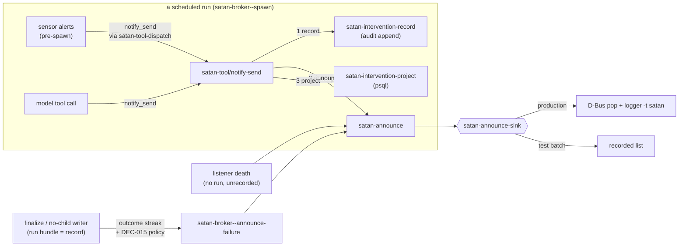
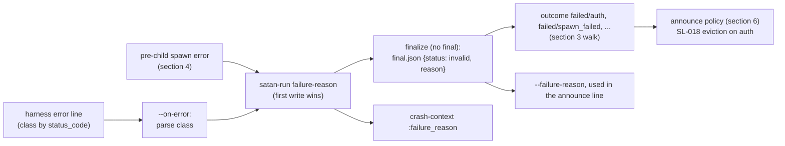
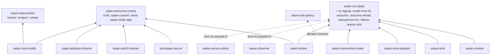

<!-- doctrine:section sec-1 -->
# Intent

SATAN tells the keeper about itself in three situations:

- a run failed;
- a sensor degraded, or the model chose to notify;
- a background listener died.

In each situation the message can fail to arrive, or arrive with no record:

- **A failure that persists goes quiet.** The broker announces a failure only
  when the failure streak is exactly 1. It counts that streak across every mode
  and by directory suffix alone, so a tick or interactive run in between resets
  it. The ISS-012 outage announced once (2026-09-22 09:16) and then fell silent
  (ISS-017).
- **A sensor alert is shown but never recorded.** Pre-spawn sensor alerts use a
  synthetic tool context that has no audit handle. The intervention write
  rejects it after the D-Bus notification has already fired, so nothing records
  the action (SPEC-001 REQ-003) and the cooldown never arms: 221 unrecorded,
  repeated alerts on disk (ISS-016).
- **The test suite writes into the evidence.** Unstubbed tests reach the real
  announcer, so `just test` writes `satan[PID]` journal lines and fires real
  desktop notifications. SATAN's own diagnostics then read those lines (ISS-015).
- **The reason is lost.** The harness classifies a provider error (`auth`,
  `rate_limit`, …), but the broker drops the classification, so an expired key
  is announced as the word "failed" (IMP-005, partial).

This slice makes SATAN's self-reports **single-path, recorded, persistent and
specific**:

- every user-facing emit goes through one seam;
- an alert is recorded before it is shown;
- a failure keeps being announced on a back-off for as long as it persists;
- the harness's error class becomes the failed run's recorded reason.

SL-018 (credential policy) builds on two of these results: the per-mode outcome
streak, and the recorded `auth` reason.

## The shape

The diagram shows who emits, what each emit is recorded in, and the one path
all emits share.



The diagram, emit by emit:

- **Every emit reaches the keeper through `satan-announce`**, and so through
  whichever sink is installed. Nothing else calls `notifications-notify` or
  `logger`.
- **Intervention emits** (sensor alerts and the model's `notify_send`) are
  written to the audit log *before* they are shown. Their Postgres row is
  written after.
- **Failure announcements** come after the run's own bundle (status,
  `final.json`, `.FAILED` rename), which is their record. The broker consults
  the per-mode outcome streak to decide whether to announce.
- **Listener deaths** happen outside any run, so there is no audit log to write
  to. They are announced as operational alarms that leave a journal line and
  no audit record, by decision (DEC-018).

## Boundary

- **In scope.** Everything above lives in the Emacs client. SPEC-001 REQ-003
  (record every action) and authority-ledger row 4 (a single audit writer, no
  third) govern it. The slice adds no authority item and no ledger row.
- **Out of scope.**
  - Credential acquisition (SL-018).
  - A typed provider-exception layer (the rest of IMP-005).
  - `message` and `display-warning`, which are Emacs-local and never reach the
    journal or D-Bus.
  - `dl-secret.el`'s own notification.

<!-- doctrine:section sec-2 -->
# The announce seam

Governed by DEC-017.

## Current behaviour

SATAN reaches the keeper from five call sites, and they share no code:

| site | channel | guarded by |
|---|---|---|
| `satan-broker.el:339` | `call-process "logger"` | `satan-failure-syslog`, `ignore-errors` |
| `satan-broker.el:346` | `notifications-notify` | `satan-failure-notify`, streak == 1 |
| `satan-tools-notify.el:56` | `notifications-notify` | `condition-case` → tool error |
| `satan-attribute-listener.el:272` | `notifications-notify` | `condition-case` → `message` |
| `satan-patch-listener.el:109` | `notifications-notify` | `condition-case` → `message` |

Tests silence these call sites with `cl-letf` stubs, one file at a time. The
stubs miss paths. The budget-denied tests (`satan-broker-test.el:427, 481,
681`) reach the real announcer.

## Target: `satan/satan-announce.el`

A new thin module. It requires only `cl-lib` and `satan-custom`, and
`notifications` loads lazily inside the production sink. Any module can depend
on it without pulling in the tool registry. It also takes over
`satan-notify-app` from `satan-tools-notify.el`, so the broker never has to
reach into a tool module for an app name.

```elisp
(defcustom satan-notify-app "SATAN"          ; moved from satan-tools-notify.el
  "Application name shown in SATAN's desktop notifications."
  :type 'string :group 'satan)

(defvar satan-announce-sink #'satan-announce-deliver
  "Function that delivers one announcement plist; returns a D-Bus id or nil.
Only ever let-bound (by the test harness and `satan-announce-with-recorder'),
never set: a global change would silence a live Emacs.")

(defvar satan-announce-recorded nil
  "Announcements captured by `satan-announce-record', newest first.")

(cl-defun satan-announce (&key (app satan-notify-app) title body
                               (urgency 'normal) timeout journal)
  "Announce to the keeper through `satan-announce-sink'.
TITLE non-nil requests a desktop pop (BODY, URGENCY, TIMEOUT, APP apply).
JOURNAL non-nil requests one journal line.  At least one of TITLE /
JOURNAL must be given.  Returns the sink's value."
  (funcall satan-announce-sink
           (list :app app :title title :body body :urgency urgency
                 :timeout timeout :journal journal)))

(defun satan-announce-deliver (a)
  "Production sink: journal line (best effort), then the D-Bus pop."
  ...)

(defun satan-announce-record (a)
  "Test sink: push A onto `satan-announce-recorded'; return a fake id."
  ...)

(defmacro satan-announce-with-recorder (&rest body)
  "Run BODY with the recording sink and a fresh `satan-announce-recorded'."
  `(let ((satan-announce-sink #'satan-announce-record)
         (satan-announce-recorded nil))
     ,@body))
```

### Contract

- **Journal line.** It runs `logger -t satan -p user.warn JOURNAL`, with the
  same tag and priority as today, so existing `journalctl --user -t satan`
  readers still work. The text must be ASCII: `logger` receives bytes encoded
  in the locale's coding system, and a non-ASCII character does not survive a
  C locale.
- **Journal failure.** It is best effort. A missing `logger(1)` must never
  fail an emit, just as with today's `ignore-errors`.
- **Journal-only announcements** omit `:title`. The failure announcer sends
  one at every streak position where DEC-015 says no pop is due.
- **Pop failure propagates.** `satan-tool/notify-send` must know when the
  keeper did not see an alert (section 5). The broker and the listeners wrap
  their calls, as they do today.
- **`:app`** defaults to `satan-notify-app`. The listeners pass their own
  `*-notify-app`.
- **Category switches stay with their callers.** `satan-failure-notify` and
  `satan-failure-syslog` decide *whether* the broker asks for a pop or a
  journal line. The seam decides only *how* the announcement is delivered.
  The REQ-005 kill switches and the `notify` capability gate therefore stay
  where they are.

## Test hermeticity

The harness owns hermeticity, one level up from each test file.

- **The whole suite runs inside one binding.** `satan-test-run-batch`
  (`dev/satan-test.el:65`) wraps its load-and-run in
  `(let ((satan-announce-sink #'satan-announce-record)) …)`, next to the
  existing guard against the production database. Nothing the suite does can
  reach D-Bus or the journal, whatever a test forgets to stub. Because the
  binding is a `let` and not a `setq`, running the harness inside a live Emacs
  does not silence that Emacs's alerts once the run ends.
- **Tests that assert on an emit** wrap themselves in
  `satan-announce-with-recorder` and inspect `satan-announce-recorded`. The
  macro also makes such a test hermetic when it runs on its own, outside the
  harness.
- **The per-file stubs are removed.** Every `cl-letf` of `notifications-notify`
  and of `call-process "logger"` goes, so the recorder is the only mechanism.
- **The exception is `satan-announce-deliver`'s own unit tests.** They stub
  `notifications-notify` and `call-process` locally, because delivery is the
  unit under test.
- **Production code never checks `noninteractive`.** A batch-mode production
  path that silently swallowed alerts would recreate the failure this slice
  removes.

<!-- doctrine:section sec-3 -->
# Run outcomes and the streak

Governed by DEC-014. This section is the contract SL-018 consumes.

## Current behaviour

`satan-broker--failure-streak-count` (`satan-broker.el:311`) sorts every run
directory under `satan-runs-dir` newest-first. It counts leading `.FAILED`
suffixes and reads nothing inside the directories. This has three consequences:

- **It is global.** A `tick-pulse` success or an interactive MCP run between
  two `motd` failures resets the `motd` streak to zero.
- **It sees only the suffix.** A `session_blocked` run is `status=failed` but is
  deliberately left un-renamed (DEC-8). Its directory therefore *ends* the walk,
  and the next failure counts as streak 1 again. That is the opposite of the
  DEC-8 comment's intent (`satan-broker.el:535-537`).
- **It cannot count anything except failure.** SL-018 needs "N consecutive
  `credential_deferred` runs of this mode".

## Target: the outcome of a run

An **outcome** is what a finished run recorded about itself:

- its `status` file, one of `done`, `failed`, `timed-out`, `invalid-protocol`
  or `budget-exceeded` (`satan-audit.el:685-692`);
- the `reason` in its `final.json`.

No-child runs already put their cause in `reason` (`session_blocked`,
`perceive_failed`, `budget_daily_tokens`). From section 7 on, a child that
dies without a final does too, carrying its error class.

```elisp
;; satan-run.el — leaf; json-parse-buffer is built in, so no new require.

(defconst satan-run-id-regexp
  "\\`\\([0-9]\\{8\\}T[0-9]\\{6\\}\\)-\\(.+\\)-\\([0-9a-f]\\{6\\}\\)\\'"
  "A run-id: group 1 timestamp, 2 mode name (may contain hyphens), 3 hex.")

(defun satan-run-mode-from-id (run-id)
  "Return the mode name inside RUN-ID (a leaf with or without `.FAILED'), or nil.
\"20260923T081501-tick-pulse-33ec98\" -> \"tick-pulse\"."
  ...)

(defun satan-run-outcome (dir)
  "Return DIR's recorded outcome, or nil when DIR has no `status' file.
Plist: (:run-id ID :mode MODE :status SYMBOL :reason STRING-OR-NIL :dir DIR).
A missing or unparseable `final.json' yields :reason nil."
  ...)

(defun satan-run-outcome-streak (mode counts-p &optional skips-p runs-dir)
  "Return MODE's current streak as a list of outcomes, newest first.
Walks MODE's runs in RUNS-DIR (default `satan-runs-dir') from newest
back.  A run with no outcome is stepped over; an outcome satisfying
SKIPS-P is stepped over; one satisfying COUNTS-P is collected; any
other outcome ends the walk.  SKIPS-P is tested before COUNTS-P."
  ...)
```

The function returns the outcomes themselves, not a count. The caller then has:

- the **position**, `(length streak)`;
- the **first run** of the streak, `(car (last streak))`, which the
  announcement names.

The walk is **policy-free**. Which outcomes count, and which are stepped over,
is decided by the caller.

### Who parses run-ids

`satan-run.el` owns run identity (DEC-001), yet two modules parse run-ids
themselves today:

- `satan-tank.el:90` uses an ad-hoc mode regexp;
- `satan-context.el:245` defines `satan-context--run-id-regexp`, which also
  pulls out the date and `.FAILED`.

This slice adds the third reader, so all three move onto `satan-run.el`:

- `satan-tank` calls `satan-run-mode-from-id`;
- `satan-context` builds its date and `.FAILED` groups on
  `satan-run-id-regexp`, and stops defining its own id grammar.

### The failure streak (broker policy)

The failure streak is a **same-cause** streak, per DEC-015. It counts
consecutive failures whose status and reason match the newest run's. A new
cause therefore starts again at position 1, and the announcement names that
cause's own first run.

```elisp
;; satan-broker.el
(defconst satan-broker--streak-transparent-reasons
  '("session_blocked" "credential_deferred")
  "Reasons of runs that neither extend nor break a failure streak.")

(defun satan-broker--failure-streak (mode-name newest)
  "MODE-NAME's same-cause failure streak ending at outcome NEWEST."
  (let ((cause (list (plist-get newest :status) (plist-get newest :reason))))
    (satan-run-outcome-streak
     mode-name
     (lambda (o) (equal (list (plist-get o :status) (plist-get o :reason)) cause))
     (lambda (o) (member (plist-get o :reason)
                         satan-broker--streak-transparent-reasons)))))
```

`NEWEST` is the outcome of the run being announced, which the broker reads with
`satan-run-outcome` on that run's directory.

`credential_deferred` is listed now so that SL-018's outcome is transparent to
the failure streak from the day it first appears. It is only a string, so no
code in this slice depends on SL-018.

### Example

This example walks the failure streak (same cause: `failed`/`auth`) back from
`0924T0815-motd`, newest first. Runs of every other mode are never visited.

| run | status / reason | step |
|---|---|---|
| `0924T0815-motd` | failed / auth | count → 1 |
| `0923T1200-motd` | *(no `status` file: in flight, or Emacs died)* | step over |
| `0923T0830-motd` | failed / session_blocked | step over |
| `0923T0815-motd` | failed / auth | count → 2 |
| `0922T0815-motd` | failed / unknown | stop (another cause) |

Result: position 2, first run `0923T0815-motd`.

### SL-018's use (illustrative, not built here)

```elisp
(satan-run-outcome-streak
 mode (lambda (o) (equal (plist-get o :reason) "credential_deferred"))
 (lambda (o) (equal (plist-get o :reason) "session_blocked")))
```

## Properties

- **Derived, not stored.** The run bundles already on disk are the only input.
  No counter file exists and no third writer is added (ADR-018 D5; ledger
  row 4).
- **Owned by the leaf.** Run discovery (`satan-run-list-dirs`) and run identity
  belong to `satan-run.el` (DEC-001). The outcome reader sits beside them. Its
  requires stay `cl-lib`/`subr-x`/`satan-custom`.
- **Cost.** Listing all run directories costs what today's walk costs. The walk
  then reads `status` and `final.json` only until the streak ends, so the reads
  are bounded by streak length plus the runs stepped over.
- **A run with no outcome is rare, and stays rare.** Only two things leave a
  run without a `status` file: a run still in flight, and an Emacs that died
  mid-run. A spawn error before the child starts now finalises as
  `failed`/`spawn_failed` (section 4). It is announced and counted, not stepped
  over.
- **The rename is a view.** The `.FAILED` suffix stays as a human affordance
  for `ls`, but nothing counts it any more.
- **Timing.** The broker calls the walk *after* `satan-audit-close` and the
  rename, so the run being announced is already visible to the walk as
  position ≥ 1.

<!-- doctrine:section sec-4 -->
# One tool-ctx, and a spawn that cannot fail silently

Governed by DEC-016, with DEC-019 for `spawn_failed`.

A **tool-ctx** is the plist that tool handlers and the intervention write API
receive: run-id, mode name, frozen time, capabilities, audit handle and
percept handles. `satan-intervention--ctx-required`
(`satan-intervention.el:332`) is the single check that it carries `:id`,
`:mode-name`, `:time-now` and `:audit`.

## Current behaviour

Five functions build tool-ctx plists. Only one of them lives where DEC-001
puts tool-ctx ownership, in `satan-run.el`:

| builder | used for | problem |
|---|---|---|
| `satan-run-tool-ctx` (`satan-run.el:225`), from a `satan-run` struct | in-run tool calls, output handler, MCP | none: the canonical one |
| `satan-sensor-alerts--make-tool-ctx` (`satan-sensor-alerts.el:297`) | pre-spawn alerts | **no `:audit`**, no `:percept-handles`, and the id `pre-spawn-<mode>` joins no run. This causes ISS-016's 221 failures. |
| `satan-observer--ctx-from-run-ctx` (`satan-observer.el:328`) | pre-spawn outcome classification | a hand-built copy from the `prepare` plist |
| `satan-intervention-mark--build-ctx` (`satan-intervention-mark.el:97`) | manual `M-x` marks | duplicate of the atsatan builder below |
| `satan-tools-atsatan--intervention-ctx` (`satan-tools-atsatan.el:468`) | `@satan` outcome directives | duplicate of the mark builder above |

`satan-broker--spawn` also has a gap. If anything throws between
`satan-audit-open` (`:612`) and `make-process` (the context function, the
bundle write, the process launch), the run is left with a truncated transcript
and no `status` file. Nothing announces it. One such run exists from
2026-06-21 (`20260621T090011-tick-pulse-8b31a5`), and under a per-mode walk
it would be stepped over for ever.

## Target

Every tool-ctx is built in `satan-run.el`. A spawn that fails before its child
starts finalises like any other failed run.

```mermaid
sequenceDiagram
  participant S as satan-broker--spawn
  participant R as satan-run.el
  participant O as satan-observer-process
  participant A as satan-sensor-alerts-check
  participant F as satan-broker--finalize
  S->>S: audit <- satan-audit-open
  S->>R: run-ctx <- make-satan-run (:audit audit :prepare prepare ...)
  Note over S,F: condition-case from here until the child is started
  S->>R: satan-run-tool-ctx run-ctx
  S->>O: process tool-ctx
  S->>S: prepare <- enrich; setf (satan-run-prepare run-ctx)
  S->>A: check ... :tool-ctx (satan-run-tool-ctx run-ctx)
  S->>S: prepare <- :pre_spawn; setf slot; bundle; make-process
  alt error before the child starts
    S->>F: failure-reason <- "spawn_failed"; status 'failed; finalize
    F-->>S: status, final.json, .FAILED, announce (sections 6-7)
  end
```

### `satan-broker--spawn`

- **The single `make-satan-run` moves up**, to immediately after
  `satan-audit-open`, and the call at `:679` is removed. Every slot value is
  bound by then: `run-id`, `dir`, `bundle-path`, `stdout-log`, `audit`,
  `prepare`.
- **Every later rebind of `prepare` is followed by
  `(setf (satan-run-prepare run-ctx) prepare)`.** There are three: the
  observer result, enrich, and `:pre_spawn`. Nothing relies on `plist-put`
  mutating a shared cons.
- **Pre-child errors finalise the run.** Everything from the struct's creation
  until the child process exists runs inside a `condition-case`. Its handler:
  1. records `(satan-audit-record audit 'broker 'spawn-failed (:error MSG))`;
  2. sets the struct's `failure-reason` to `"spawn_failed"` and its status to
     `'failed`;
  3. calls `satan-broker--finalize`.

  Finalize then writes `status`, a `final.json` whose reason is
  `spawn_failed` (section 7), the `.FAILED` rename and the announcement.
  Soft-failing stages that already `condition-case` themselves (the observer,
  the probes, the sensor alerts) keep their own handling.
- **The probe commits and the ingest cursor are unaffected.** They run after
  the sensor alerts and before the bundle, as today. A `spawn_failed` run
  therefore commits its probes, exactly as a run that spawned and then failed
  does today.

### The other builders

- **`satan-sensor-alerts-check`** takes `:tool-ctx` instead of `:run-dir`,
  which it used only to build the synthetic context.
  `satan-sensor-alerts--make-tool-ctx` is deleted. The A17 capability gate
  still works: `satan-run-tool-ctx` copies the mode's `:capabilities`, so
  removing `notify` from a mode still yields `capability_denied`.
  `--notify-call` keeps its tool-call `:id` (`pre-spawn-<cause>`), which names
  the call, not the intervention.
- **`satan-observer-process`** takes the tool-ctx in place of the `prepare`
  plist. It reads `:time-now` and passes the tool-ctx to the classify API.
  `satan-observer--ctx-from-run-ctx` is deleted. Its `opts` argument is
  unchanged.
- **`satan-run-manual-tool-ctx (run-id audit now)`** replaces the two identical
  manual builders. It returns `:id RUN-ID :mode-name "manual-mark" :time-now
  NOW :audit AUDIT :capabilities ()`. `satan-intervention-mark` and
  `satan-tools-atsatan` both call it.

## Consequences

- **Pre-spawn interventions mint as `<run-id>.ivNNN`** and carry
  `percept_handles`, so the observer's correlation gate can reach them
  (mem_01a0c168d5eb795387f47fc818fe2810). No earlier pre-spawn intervention
  was ever written, so no old id shape needs migrating. The IMP-001/IMP-002
  cross-checks are re-run against one in verification.
- **`:mode-name` loses its `/pre-spawn` suffix.** Nothing reads the suffix (rg,
  2026-09-23). A pre-spawn alert remains identifiable by its message
  (`SATAN sensor: <cause>`) and by the `pre_spawn` block in `actions.json`.
- **`satan-intervention--ctx-required` is unchanged.** One contract means the
  invariant is enforced at one point (REQ-009).
- **`rg '(list :id' satan/*.el`** finds tool-ctx construction only in
  `satan-run.el`.

<!-- doctrine:section sec-5 -->
# Record before emit

Governed by DEC-018 and SPEC-001 REQ-003, which requires every enacted action
to be appended to a durable, immutable audit log.

## What counts as the record

`satan-intervention-create` writes an intervention to two places:

| store | role |
|---|---|
| `intervention.created`, appended to the run's `transcript.jsonl` by `satan-audit-record` | **the record**: canonical and append-only. This is ledger row 4's single writer. |
| a row in `satan_interventions` | a **projection**. The observer queries it, and it can be rebuilt from the transcript (`satan-intervention-rebuild`). |

The function's own docstring agrees: "The audit record is canonical; a
DB-side failure leaves the run's audit log intact"
(`satan-intervention.el:385`). REQ-003 is therefore satisfied by the audit
append, and only the append has to come before the keeper sees anything.

## Current behaviour

`satan-tool/notify-send` shows the alert first (`satan-tools-notify.el:56`)
and calls `satan-intervention-create` afterwards (`:65`). The pre-spawn path
therefore emits without a record. Even with a valid ctx, a failure in either
store reports a tool error for an alert the keeper has already seen.

## Target

`satan-intervention-create` is split into two halves. It stays as their
composition, for callers that do not emit (see the end of this section).

```elisp
;; satan-intervention.el
(cl-defun satan-intervention-record
    (&key ctx kind target-surface message related-motive-id cue-handles
          expected-outcome outcome-window-minutes severity)
  "Validate, mint the id, append `intervention.created' to CTX's audit.
Returns the payload plist (carrying :intervention_id).  Signals on an
invalid ctx, a validator failure, or an append failure — and then
nothing has been recorded.")

(cl-defun satan-intervention-project
    (payload &key (db satan-memory-migrate-database))
  "INSERT PAYLOAD into the `satan_interventions' projection (idempotent,
ON CONFLICT DO NOTHING).  Signals on psql failure.")

(cl-defun satan-intervention-create (&rest args &key db &allow-other-keys)
  "Record then project; return the intervention id.  Unchanged contract."
  ...)
```

`satan-tool/notify-send` becomes:

```mermaid
flowchart TD
  V["validate args"] --> REC["payload <- satan-intervention-record"]
  REC -- signals --> E1["(error ...)<br/>nothing shown, nothing recorded"]
  REC --> AN["id <- satan-announce :title :body :urgency :timeout"]
  AN -- "pop signals" --> UD["satan-intervention-classify :classification unknown<br/>:notes \"undelivered: ERR\""]
  UD --> OK3["(ok :id nil :intervention_id IV :delivered :false :error ERR)"]
  AN --> PR["satan-intervention-project payload"]
  PR -- signals --> OK2["(ok :id ID :intervention_id IV :projection \"failed: ...\")"]
  PR --> OK1["(ok :id ID :intervention_id IV)"]
```

How each branch meets the rule:

- **Nothing is shown until the audit line exists.** REQ-003 holds by
  construction.
- **A Postgres outage cannot silence an alert.** The projection comes last,
  and its failure is only a note on an `ok` result.
- **A pop that fails after the record is marked in the record itself.** The
  existing classify API (`satan-intervention.el:404`) appends
  `intervention.outcome_classified` with classification `unknown` and a note
  that starts `undelivered:`. No new event type or vocabulary is added.
  - The observer does not score the intervention as if it had been seen.
  - `satan-intervention-rebuild` replays both events, so it cannot resurrect a
    pending, unseen alert.
  - The result is `ok` with `:delivered :false`, because the action was
    recorded; it tells the model plainly that nothing was shown. The classify
    step's own projection write may fail too, which is harmless, because its
    audit event is already down.
- **The result shape passes `satan-protocol--validate-tool-result`**
  (RV-009, verified).

## Sensor alerts and the cooldown

A sensor alert goes through the same `notify_send`, via `satan-tool-dispatch`.
`--dispatch` treats `:ok t` as dispatched and arms the per-cause cooldown
(`satan-sensor-alerts.el:368`). Because every recorded outcome returns `ok`,
**the cooldown arms on the record**, whatever happens to the pop or the
projection. With D-Bus down, that means one record per cause per cooldown
window (24 h by default), not one per run. Each such record is already
classified as undelivered.

## Emits that are not interventions: operational alarms

Two emits are not actions on the keeper's world. They report SATAN's own
state, and neither gets an intervention record. The authority-ledger row 4
standing note is revised (REV) to name both, so no future audit mistakes them
for audit writers.

- **Failure announcements** (section 6) come after `satan-audit-close` and the
  `.FAILED` rename. The run bundle is their record: `status`, `final.json`,
  the transcript and `crash-context`. That record exists before the
  announcement. The decision to pop at a given streak position is derived from
  those bundles, so it is reproducible and needs no record of its own. The
  journal line is written for every failure regardless.
- **Listener deaths** (`satan-attribute-listener--report-death`,
  `satan-patch-listener--report-death`) happen outside any run, with no audit
  handle. They call `satan-announce` with a critical pop *and* a `:journal`
  line, and the journal line is their only durable trace. Recording them in
  the audit log would need a third audit writer, which ledger row 4 forbids.

## Tests must not reach the production projection

`satan-memory-migrate-database` defaults to `satan_memory`, the production
database. The verification invocation `SATAN_DB_HOST=/run/postgresql/`
reaches the production server (mem_01a0316176b17672988b91759e145e5d). Today
the tests stub `satan-intervention-create` wholesale. After the split:

- **Tests of `notify_send`, the sensor alerts and the observer** stub
  `satan-intervention-project` (and classify's projection) at the database
  boundary, and assert it was called with the recorded payload. The record
  step runs for real against a temporary audit handle, so ISS-016's class of
  defect cannot hide behind a stub again.
- **Only `satan-intervention-test.el`** exercises a real projection, and it
  uses its own test database.

## Out of scope, noted

Several other intervention-creating tools also produce their side effect first
and call `create` afterwards: `sway_border_set` (`satan-tools-sway.el:135`),
`inbox_append`, `proposal_stage` and `patch_job_create`. This is the same
REQ-003 ordering question, but for effects that are not emits. They stay on
`satan-intervention-create` in this slice, and the question is captured as a
backlog item.

<!-- doctrine:section sec-6 -->
# Announce policy

Governed by DEC-015. This section uses the streak from section 3.

## Current behaviour

`satan-broker--announce-failure` (`satan-broker.el:331`) does two things:

- It writes a journal line for every failure.
- It pops a desktop notification only when the global streak is exactly 1.

The line reads `<status> <mode> <run-id> <reason>`, and for a child that died
without a final the reason is the literal word `failed`.

## Target

```elisp
(defun satan-broker--announce-due-p (outcome position)
  "Non-nil when a desktop pop is due for OUTCOME at streak POSITION.
Pure.  auth reason -> always; budget-exceeded -> only at 1;
otherwise POSITION is a power of two (1, 2, 4, 8, ...)."
  (cond ((equal (plist-get outcome :reason) "auth") t)
        ((eq (plist-get outcome :status) 'budget-exceeded) (= position 1))
        (t (zerop (logand position (1- position))))))

(defun satan-broker--announce-failure (run-id mode-name status reason dir)
  ;; both call sites (finalize rename, no-child writer) pass the renamed DIR
  (let* ((newest   (or (satan-run-outcome dir)
                       (list :run-id run-id :status status :reason reason)))
         (streak   (satan-broker--failure-streak mode-name newest)) ; section 3
         (position (max 1 (length streak)))
         (first-id (plist-get (car (last streak)) :run-id))
         (line     (satan-broker--failure-line
                    status mode-name run-id reason position first-id))
         (pop      (and satan-failure-notify
                        (satan-broker--announce-due-p newest position)
                        (not (satan-broker--quiet-p)))))
    (when (or pop satan-failure-syslog)
      (ignore-errors
        (satan-announce
         :title (and pop (format "SATAN %s (%s) x%d" status mode-name position))
         :body line
         :urgency (if (equal (plist-get newest :reason) "auth") 'critical 'normal)
         :journal (and satan-failure-syslog line))))))
```

### Line format

`<status> <mode> <run-id> <reason> x<position> since <first-run-id>`

The ` since …` part is omitted at position 1. An example:

```
failed motd 20260926T081501-motd-9a01c2 auth x4 since 20260923T081501-motd-33ec98
```

The first four fields are unchanged, so existing `journalctl -t satan` readers
still parse the line. The text is ASCII only (section 2).

### Policy decisions

- **The position is derived.** It is the length of the per-mode
  **same-cause** failure streak (section 3), and the broker keeps no state. A
  new cause starts again at 1 and pops immediately. So twelve budget denials
  followed by a 500 give the 500 position 1, not 13, and the line names the
  500's own first run. `(max 1 …)` guards against a walk that
  somehow misses the run being announced; that should not happen, because the
  walk runs after close and rename.
- **The policy reads the newest outcome's reason, not the display reason.**
  After section 7, a classified failure's `final.json` reason is its class, so
  `auth` is matched structurally. The `reason` argument stays display-only.
  For example, a budget denial passes `"500000/400000 tokens"`.
- **An `auth` failure pops at every position, at critical urgency.** A human
  must act on an expired key. After SL-018, an `auth` failure also evicts the
  cached reference, so a repeat means the new key is bad too.
- **`budget-exceeded` pops once per streak.** It cannot change before
  midnight, so a repeat carries no information. The journal still gets a line
  for every denied run.
  - Known limit: the ceiling is global but streaks are per mode, so a breach
    pops at most once for each scheduled mode per day (3-4 pops). That is
    accepted as bounded.
- **Quiet hours** go through `satan-tick-quiet-p`, the ledger row 7 owner, via
  a small `satan-broker--quiet-p` that uses the `declare-function` precedent
  from `satan-sensor-alerts.el:20`. `satan-tick` requires `satan-broker`, so the
  broker cannot require it back. When the function is not bound, it is not
  quiet. A position that falls inside quiet hours is not replayed later, and
  the journal line is still written. Today `satan-tick-quiet-hours` is nil, so
  this is inert until quiet hours are re-enabled.

### Noise bound

| mode cadence | persistently broken for | pops |
|---|---|---|
| tick, every 30 min, one cause | 24 h (48 runs) | 6 (positions 1, 2, 4, 8, 16, 32) |
| motd, daily, one cause | 30 days | 5 (days 1, 2, 4, 8, 16) |
| any, alternating causes | n runs | up to n (each switch is new information) |
| any, `auth` | n runs | n (by design) |

## Kill switches

`satan-failure-notify` still vetoes every failure pop, and
`satan-failure-syslog` still vetoes every failure journal line. Their
docstrings are updated to describe the back-off instead of "first failure of a
streak".

<!-- doctrine:section sec-7 -->
# Failure reason: class transport and spawn failure

Governed by DEC-019. This covers only the transport part of IMP-005; it adds
no typed exception layer.

## Current behaviour

- **How the harness classifies errors.** It classifies an exception from the
  provider with `classify_error` (`satan/harness/runloop.py:115`), using bare
  substring tests: `"rate"`, `"auth"`, `"401"` and so on. So `"generate"`
  reads as a rate limit, `"author"` reads as an auth error, and any digit run
  containing `401` reads as an auth error too.
- **How it sends the class.** The class goes out double-encoded:

  ```json
  {"type":"error","error":"{\"class\": \"auth\", \"detail\": \"Error code: 401 ... API key expired\", \"tokens_total\": 0, \"turn\": 0}"}
  ```

- **Where the class is lost.** `satan-broker--on-error`
  (`satan-broker.el:166`) records the object and sets `'failed`, and the class
  goes no further:
  - `final.json` is written as `{"status":"invalid"}` (`satan-audit.el:123`);
  - `crash-context` has no class field;
  - the announcement's reason is the word `failed`.
- **Errors that carry no class at all.** Init-path errors are plain strings,
  e.g. `init failed: OPENROUTER_API_KEY not set` (`runloop.py:178`). A
  pre-child spawn error leaves no record (section 4).

## Target



### Harness: `classify_error`

The status code is read first. Text matching is only a fallback, and it
matches whole words.

```python
def classify_error(e: Exception) -> str:
    code = getattr(e, "status_code", None)        # openai.APIStatusError et al.
    if code in (401, 403):             return "auth"
    if code == 429:                    return "rate_limit"
    if isinstance(code, int) and code >= 500: return "server"
    msg = str(e).lower()
    if re.search(r"\b(429|rate[ _-]?limit(ed)?|quota)\b", msg): return "rate_limit"
    if re.search(r"\b(401|403|unauthori[sz]ed|authentication|forbidden|invalid api key|api key expired)\b", msg): return "auth"
    if re.search(r"\b(500|502|503|504)\b", msg): return "server"
    if re.search(r"\b(timeout|timed out)\b", msg): return "timeout"
    return "unknown"
```

- **Tests.** The existing cases in `test_gptel_harness.py:267` keep passing. New
  cases cover the false positives (`"generate"`, `"author"`, `"4013 tokens"`)
  and the `status_code` paths.
- **Init-path errors stay unclassified.** They read as `unknown`. SL-018 moves
  key resolution before the spawn, so `KEY not set` should stop reaching the
  harness.
- **Deploy.** The jail runs the harness from the GitHub flake input
  (mem_01a09dd9b5bc704388093135ea89e9f2). Shipping this change therefore
  takes a push, a `nix flake update satan` in `~/flakes`, and a home-switch.
  That is a step on the slice's deploy checklist. The elisp half works either
  way; until the new harness is live, it just receives the old, noisier
  classes.

### Broker

- **A new `satan-run` slot, `failure-reason`.** It is appended last in the
  `cl-defstruct`. Two paths write it, and the first write wins:
  - **`--on-error`** stores `(satan-broker--error-class obj)`. That pure helper
    parses `(plist-get obj :error)` with
    `json-parse-string :object-type 'plist` and returns its `:class` if that
    is a string, and `"unknown"` otherwise (including when the error is not
    JSON). The protocol guarantees `:error` is a string.
  - **The pre-child spawn handler** (section 4) stores `"spawn_failed"`.
- **Finalize.** When the run has no final and `failure-reason` is set,
  finalize hands `satan-audit-close` a synthesised final,
  `(:status "invalid" :reason FAILURE-REASON)`. `satan-audit` stays generic;
  the broker owns what a failed run's reason is.
- **`satan-broker--crash-context`** adds `:failure_reason`.
- **`satan-broker--failure-reason`** resolves the reason in this order: the
  final's `:reason`, then `failure-reason`, then the status name.

## Resulting outcomes

| failure | `final.json` reason | outcome |
|---|---|---|
| provider 401 / 403 | `auth` | failed / auth |
| provider 429 | `rate_limit` | failed / rate_limit |
| init `KEY not set` | `unknown` | failed / unknown (SL-018 removes this path) |
| error before the child starts | `spawn_failed` | failed / spawn_failed |
| timeout | *(none)* | timed-out / nil |
| no-child denials | unchanged (`session_blocked`, `budget_daily_tokens`, …) | unchanged |

The existing `final.json` consumers tolerate the added `reason` key
(RV-009, verified):

- `actions-partition-final` handles a missing `:actions`;
- `satan-context` reads only `:summary`;
- the `satan-audit-p/*` checks do not constrain an `invalid` final.

<!-- doctrine:section sec-8 -->
# Code impact

## Module dependencies after the change

Only the edges this slice adds or relies on are shown.



- **`satan-announce` needs no SATAN module except `satan-custom`.** It
  cannot create a cycle.
- **`satan-run` keeps its I3 requires**, which are `cl-lib`, `subr-x` and
  `satan-custom`. JSON parsing uses built-ins.
- **`satan-tools-notify` still requires `satan-announce`**, because the
  `satan-notify-app` defcustom has moved there.

## Paths and intended changes

| path | change | section |
|---|---|---|
| `satan/satan-announce.el` | **New.** `satan-notify-app` (moved), `satan-announce`, `-sink`, `-deliver`, `-record`, `-recorded`, `-with-recorder`. | 2 |
| `satan/satan-run.el` | Adds `satan-run-id-regexp`, `-mode-from-id`, `-outcome`, `-outcome-streak` and `-manual-tool-ctx`, plus the `failure-reason` slot. | 3, 4, 7 |
| `satan/satan-broker.el` | `--announce-failure` rewritten (seam, policy, `dir` argument).<br>Adds `--announce-due-p`, `--failure-streak`, `--streak-transparent-reasons`, `--failure-line`, `--quiet-p`, `--error-class`.<br>Removes `--failure-streak-count` and the `notifications` declare-function.<br>`--spawn`: early struct, prepare sync, pre-child `condition-case`.<br>`--on-error`, finalize, `--crash-context`, `--failure-reason`: failure reason.<br>`--mark-failed-on-disk`, `--write-no-child-run`: pass the renamed `dir`. | 3, 4, 6, 7 |
| `satan/satan-intervention.el` | `-create` split into `-record` and `-project`; `-create` kept as their composition. | 5 |
| `satan/satan-tools-notify.el` | record → announce → project, with undelivered classification. Drops `(require 'notifications)` and the `satan-notify-app` defcustom. | 5 |
| `satan/satan-sensor-alerts.el` | `-check` takes `:tool-ctx`; `--make-tool-ctx` deleted. | 4 |
| `satan/satan-observer.el` | `-process` takes the tool-ctx; `--ctx-from-run-ctx` deleted. | 4 |
| `satan/satan-intervention-mark.el`, `satan/satan-tools-atsatan.el` | Use `satan-run-manual-tool-ctx`; own builders deleted. | 4 |
| `satan/satan-tank.el`, `satan/satan-context.el` | Parse run-ids via `satan-run.el`. | 3 |
| `satan/satan-attribute-listener.el`, `satan/satan-patch-listener.el` | `--report-death` goes through `satan-announce` (critical pop + `:journal`). | 2, 5 |
| `satan/harness/runloop.py`, `satan/harness/test_gptel_harness.py` | `classify_error` by `status_code`, then word boundaries; tests. | 7 |
| `dev/satan-test.el` | `let`-binds the recording sink around load and run. | 2 |
| `satan/test/satan-announce-test.el` | **New.** Delivery unit tests, recorder, macro, batch self-check. | 2 |
| `satan/test/satan-run-test.el` | Id regexp, outcome, streak and manual ctx. | 3, 4 |
| `satan/test/satan-broker-test.el` | Streak and announce tests rewritten over outcomes and the recorder; emit stubs removed; class, spawn-failed and early-struct tests. | 3, 4, 6, 7 |
| `satan/test/satan-sensor-alerts-test.el`, `satan-tools-notify-test.el`, `satan-observer-test.el` | Real record step against a temporary audit handle; projection stubbed at the DB boundary; `satan-intervention-create`/`notifications-notify` stubs removed. | 4, 5 |
| `satan/test/satan-intervention-test.el` | Record/project split (own test DB). | 5 |
| `satan/test/satan-{attribute,patch}-listener-test.el`, `satan-tools-test.el`, `satan-intervention-mark-test.el`, `satan-tools-atsatan-test.el`, `satan-tank-test.el`, `satan-context-test.el` | Recorder or new constructor or id parser, where they touch these. | 2, 3, 4 |

## Design-target selectors

These are declared at lock (mem_01a0adb7c4f879c38d90403906dd6ea4) and checked
with `rg` (mem_019f8fbda1ed74e39d7f558044ccf592):

- `rg -n 'notifications-notify|"logger"' satan/ dev/ -g '!satan/test/**'`
  should hit only `satan/satan-announce.el`.
- `rg -n 'notifications-notify' satan/test/ -g '!satan-announce-test.el'`
  should find nothing.
- `rg -n 'make-tool-ctx|ctx-from-run-ctx|mark--build-ctx|atsatan--intervention-ctx|failure-streak-count|satan-context--run-id-regexp' satan/ dev/`
  should find nothing.
- `rg -n ':mode-name' satan/*.el`: tool-ctx construction should sit only in
  `satan-run.el`.

<!-- doctrine:section sec-9 -->
# Invariants, risks and verification

## Invariants

- **I1. One path out.** Every desktop pop and every `satan` journal line
  leaves through `satan-announce-sink`.
- **I2. Recorded before shown.**
  - An intervention emit is shown only after its `intervention.created` audit
    line exists.
  - A failure announcement is shown only after its run's `status` and
    `final.json` exist.
- **I3. The projection never gates.** A failed `satan_interventions` insert
  never suppresses an emit and never un-arms a cooldown.
- **I4. Unseen is marked.** A recorded intervention whose pop failed carries an
  `unknown`/`undelivered` classification in the same transcript.
- **I5. Streaks are derived.** They are computed from run bundles on each call,
  per mode and per cause. No counter is stored.
- **I6. Every tool-ctx is built in `satan-run.el`,** and
  `satan-intervention--ctx-required` is its one check.
- **I7. No terminal-less spawn.** A scheduled run that reached `--spawn` ends
  with a `status` file, unless the Emacs process itself dies.
- **I8. The leaf stays a leaf.** `satan-run.el` requires only
  `cl-lib`/`subr-x`/`satan-custom`.
- **I9. One audit writer.** No new audit writer is added (ledger row 4).
- **I10. The sink is only let-bound, never set.** Production code never
  branches on `noninteractive` to decide delivery.

## Risks

| id | risk | mitigation |
|---|---|---|
| R3 | Operational alarms (failure announcements, listener deaths) have no intervention record. | They are classified as operational alarms (section 5). REV the ledger row 4 standing note. |
| R4 | The pre-spawn intervention id shape changes. | No earlier pre-spawn ids exist. Verify the observer and the IMP-001/IMP-002 cross-checks against a `<run-id>.ivNNN` pre-spawn row. |
| R5 | Quiet-hours suppression does nothing while `satan-tick-quiet-hours` is nil. | Accepted. Unit-tested through `satan-broker--quiet-p`. |
| R6 | The harness classifier change must be deployed separately (flake input). | It is a step on the deploy checklist (section 7). The elisp side is correct with either harness. |
| R7 | The streak walk reads files for each run. | The cost is bounded by streak length. Listing costs the same as today. |
| R8 | Removing per-file stubs exposes tests that relied on emits being swallowed. | The harness binding catches every emit. A test that fails once its stub is gone was asserting nothing, and it is fixed, not re-stubbed. |
| R9 | Test code reaches the production projection (`satan_memory`). | The projection is stubbed at the DB boundary outside `satan-intervention-test.el` (section 5). |
| R10 | Hoisting the struct and wrapping the spawn changes the order in the longest function in the broker. | Early-struct and spawn-failed tests cover it. The soft-failing stages keep their own handlers. |
| R11 | A budget breach pops once per scheduled mode per day. | Accepted limit (section 6). |

Assumptions:

- **A1 (narrowed).** The `auth` class is trusted on `status_code` 401/403, or
  on a whole-word match.
- **A2 (confirmed).** The audit handle exists before the sensor alerts run.

## Verification

Evidence names its invocation and counts
(mem_01a0316176b17672988b91759e145e5d). The Elisp suite runs with
`SATAN_DB_HOST=/run/postgresql/ just check`; grep the output for
`unexpected`. The harness tests run with `python -m unittest` in
`satan/harness`.

### Key test cases

**`satan-announce`**

- `satan-announce/deliver-pops-and-journals`
- `satan-announce/journal-only-when-no-title`
- `satan-announce/journal-failure-is-swallowed`
- `satan-announce/pop-failure-propagates`
- `satan-announce/with-recorder-captures-and-isolates`
- `satan-announce/batch-harness-binds-recorder`: a self-check that runs inside
  the suite.

**`satan-run`**

- `satan-run/mode-from-id-handles-hyphenated-modes-and-failed-suffix`
- `satan-run/outcome-nil-without-status`
- `satan-run/outcome-reads-status-and-reason`
- `satan-run/streak-is-per-mode`: another mode's `done` does not break it.
- `satan-run/streak-steps-over-skips-and-unfinished`
- `satan-run/streak-stops-at-non-counting-outcome`
- `satan-run/manual-tool-ctx-satisfies-ctx-required`

**`satan-broker`**

- `satan-broker/announce-due-at-powers-of-two`: positions 1, 2, 4 and 8 are
  due; 3, 5, 6 and 7 are not.
- `satan-broker/failure-streak-restarts-on-new-cause`: the F-3 regression.
- `satan-broker/announce-auth-always-critical`
- `satan-broker/announce-budget-once`
- `satan-broker/announce-journals-every-failure-ascii`
- `satan-broker/announce-quiet-suppresses-pop-not-journal`
- `satan-broker/session-blocked-transparent-to-failure-streak`: the DEC-8
  regression.
- `satan-broker/budget-denied-run-is-recorded-not-delivered`: the ISS-015 leak
  now lands in the recorder.
- `satan-broker/spawn-error-before-child-finalizes-spawn-failed`: the F-4
  regression.
- `satan-broker/error-class-parsed-from-harness-json`
- `satan-broker/error-class-unknown-for-plain-string`
- `satan-broker/failed-run-final-carries-failure-reason`

**`satan-intervention` and `satan-tools-notify`**

- `satan-intervention/record-appends-before-projection`
- `satan-tools-notify/no-emit-when-record-fails`
- `satan-tools-notify/emits-and-notes-when-projection-fails`
- `satan-tools-notify/undelivered-pop-classified-unknown`

**`satan-sensor-alerts` and `satan-observer`**

- `satan-sensor-alerts/pre-spawn-intervention-joins-run`: the id is
  `<run-id>.ivNNN` and the audit line is present.
- `satan-sensor-alerts/cooldown-arms-on-record`
- `satan-sensor-alerts/capability-denied-still-suppresses`: the A17 regression.
- `satan-observer/process-uses-run-tool-ctx`

**Harness (Python)**

- `test_classify_by_status_code`
- `test_classify_no_substring_false_positives`

### Slice-level evidence

- **V1: hermeticity.** Bracket a full `just test` run with
  `journalctl -t satan --since/--until`. No line in that window may name a
  run-id that is absent from the real `satan-runs-dir`. Test runs live in temp
  directories, so a leaked line cannot name a real run. This check works while
  the live Emacs is also emitting. `satan-announce/batch-harness-binds-recorder`
  keeps the property checked on every run afterwards. Closes ISS-015.
- **V2: selectors.** The section 8 `rg` checks produce the stated hit sets.
- **V3: REQ-003 coverage.** Record coverage for the notify path, both in-run
  and pre-spawn, per REQ-012.
- **V4: live.** After the Elisp change is loaded and the harness is deployed:
  - the next degraded-sensor run produces a `<run-id>.ivNNN`
    `intervention.created` line and a `pre_spawn` entry with `:dispatched_at`,
    and `notified.json` gains `last_notified_at` (closes ISS-016);
  - a forced failure streak on a scratch mode shows the back-off in the
    journal (closes ISS-017).

## Follow-ups (not this slice)

- Backlog: record before side effect for the other intervention-creating tools
  (sway, inbox, proposal, patch). See section 5.
- REVs:
  - the ledger row 4 standing note, naming the operational alarms and the
    journal channel;
  - optionally, a SPEC-001 REQ-003 acceptance criterion: "a side effect whose
    record fails is not enacted".
- Memory: correct the `session_blocked` streak claim in
  mem_eb8e5cff794c48bd86597f94fa50b0ac.
- IMP-005 remainder: the typed exception layer.

