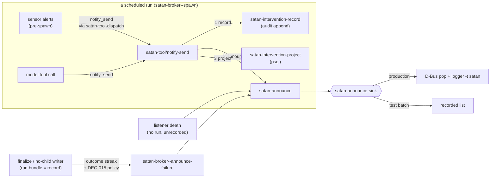
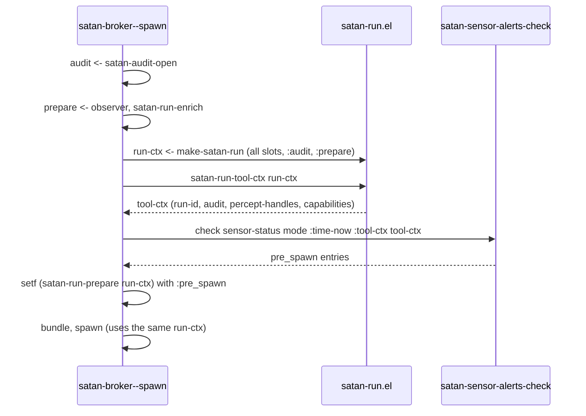
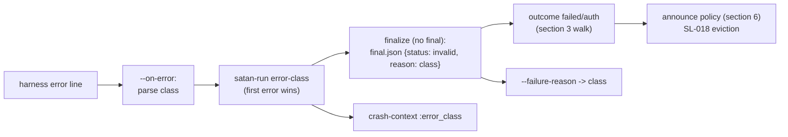
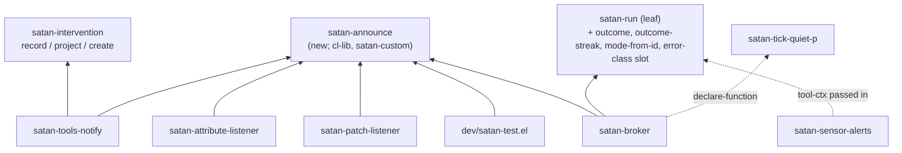

<!-- doctrine:section sec-1 -->
# Intent

SATAN tells the keeper about itself in three situations:

- a run failed;
- a sensor degraded, or the model chose to notify;
- a background listener died.

In each situation the message can fail to arrive, or arrive with no record:

- **A failure that persists goes quiet.** The broker announces a failure only
  when the failure streak is exactly 1. It counts that streak across every mode
  and by directory suffix alone, so a tick or interactive run in between resets
  it. The ISS-012 outage announced once (2026-09-22 09:16) and then fell silent
  (ISS-017).
- **A sensor alert is shown but never recorded.** Pre-spawn sensor alerts use a
  synthetic tool context that has no audit handle. The intervention write
  rejects it after the D-Bus notification has already fired, so nothing records
  the action (SPEC-001 REQ-003) and the cooldown never arms: 221 unrecorded,
  repeated alerts on disk (ISS-016).
- **The test suite writes into the evidence.** Unstubbed tests reach the real
  announcer, so `just test` writes `satan[PID]` journal lines and fires real
  desktop notifications. SATAN's own diagnostics then read those lines (ISS-015).
- **The reason is lost.** The harness classifies a provider error (`auth`,
  `rate_limit`, …), but the broker drops the classification, so an expired key
  is announced as the word "failed" (IMP-005, partial).

This slice makes SATAN's self-reports **single-path, recorded, persistent and
specific**:

- every user-facing emit goes through one seam;
- an alert is recorded before it is shown;
- a failure keeps being announced on a back-off for as long as it persists;
- the harness's error class becomes the failed run's recorded reason.

SL-018 (credential policy) builds on two of these results: the per-mode outcome
streak, and the recorded `auth` reason.

## The shape

The diagram shows who emits, what each emit is recorded in, and the one path
all emits share.



The diagram, emit by emit:

- **Every emit reaches the keeper through `satan-announce`**, and so through
  whichever sink is installed. Nothing else calls `notifications-notify` or
  `logger`.
- **Intervention emits** (sensor alerts and the model's `notify_send`) are
  written to the audit log *before* they are shown. Their Postgres row is
  written after.
- **Failure announcements** come after the run's own bundle (status,
  `final.json`, `.FAILED` rename), which is their record. The broker consults
  the per-mode outcome streak to decide whether to announce.
- **Listener deaths** happen outside any run, so there is no audit log to write
  to. They are announced as operational alarms that leave a journal line and
  no audit record, by decision (DEC-018).

## Boundary

- **In scope.** Everything above lives in the Emacs client. SPEC-001 REQ-003
  (record every action) and authority-ledger row 4 (a single audit writer, no
  third) govern it. The slice adds no authority item and no ledger row.
- **Out of scope.**
  - Credential acquisition (SL-018).
  - A typed provider-exception layer (the rest of IMP-005).
  - `message` and `display-warning`, which are Emacs-local and never reach the
    journal or D-Bus.
  - `dl-secret.el`'s own notification.

<!-- doctrine:section sec-2 -->
# The announce seam

Governed by DEC-017, with the decision that the test harness installs the sink.

## Current behaviour

SATAN reaches the keeper from five call sites, and they share no code:

| site | channel | guarded by |
|---|---|---|
| `satan-broker.el:339` | `call-process "logger"` | `satan-failure-syslog`, `ignore-errors` |
| `satan-broker.el:346` | `notifications-notify` | `satan-failure-notify`, streak == 1 |
| `satan-tools-notify.el:56` | `notifications-notify` | `condition-case` → tool error |
| `satan-attribute-listener.el:272` | `notifications-notify` | `condition-case` → `message` |
| `satan-patch-listener.el:109` | `notifications-notify` | `condition-case` → `message` |

Tests silence these call sites with `cl-letf` stubs, one test file at a time.
The stubs miss paths: the budget-denied tests (`satan-broker-test.el:427, 481,
681`) reach the real announcer.

## Target: `satan/satan-announce.el`

A new thin module. It requires only `cl-lib` and `satan-custom`, and
`notifications` loads lazily inside the production sink. Any module can depend
on it without pulling in the tool registry.

```elisp
(defvar satan-announce-sink #'satan-announce-deliver
  "Function that delivers one announcement plist; returns a D-Bus id or nil.
Production default delivers.  The batch test harness installs
`satan-announce-record' once, before any test file loads.  Never set
from production code, and never conditioned on `noninteractive'.")

(defvar satan-announce-recorded nil
  "Announcements captured by `satan-announce-record', newest first.
Tests let-bind this to nil and assert on it.")

(cl-defun satan-announce (&key app title body (urgency 'normal) timeout journal)
  "Announce to the keeper through `satan-announce-sink'.
TITLE non-nil requests a desktop pop (BODY, URGENCY, TIMEOUT, APP apply).
JOURNAL non-nil requests one `logger -t satan -p user.warn' line.
At least one of TITLE / JOURNAL must be given.  Returns the sink's value."
  (funcall satan-announce-sink
           (list :app app :title title :body body :urgency urgency
                 :timeout timeout :journal journal)))

(defun satan-announce-deliver (a)
  "Production sink: journal line (best effort), then the D-Bus pop.
The pop's errors propagate — callers decide what an undelivered pop means."
  ...)

(defun satan-announce-record (a)
  "Test sink: push A onto `satan-announce-recorded'; return a fake id."
  ...)
```

### Contract details

- **A journal-only announcement omits `:title`.** The failure announcer uses
  this form at streak positions where DEC-015 says no pop is due, so the
  journal still gets a line for every failure.
- **The journal line is best effort.** A missing `logger(1)` must never fail
  an emit, the same as today's `ignore-errors`.
- **A failed pop propagates.** `satan-tool/notify-send` must know when the
  keeper did not see the alert (section 5). The broker and the listeners wrap
  their calls, as they do today.
- **`:app` is passed by each caller.** It carries `satan-notify-app`,
  `satan-attribute-listener-notify-app` or `satan-patch-listener-notify-app`.
  The seam owns no app name. The broker's literal `"SATAN"` becomes
  `satan-notify-app`.
- **Category switches stay with their callers.** `satan-failure-notify` and
  `satan-failure-syslog` decide *whether* the broker announces a failure pop or
  a journal line. The seam decides only *how* an announcement is delivered.
  The REQ-005 kill switches and the `notify` capability gate therefore stay
  where they are. The seam adds no second enforcement point for them
  (REQ-009).

## Test hermeticity

`satan-test-run-batch` (`dev/satan-test.el:65`) sets
`satan-announce-sink` to `#'satan-announce-record`. It does this beside the
existing pre-flight guard against the production database, before it loads any
`*-test.el`. From then on, nothing the suite does can reach D-Bus or the
journal, whatever a test forgets to stub.

- **Tests that assert on an emit** let-bind `satan-announce-recorded` to nil
  and inspect it. That replaces every `cl-letf` of `notifications-notify` and of
  `call-process "logger"`. REQ-009 allows one mechanism, so the per-file stubs
  are removed, not left beside the recorder.
- **Unit tests of `satan-announce-deliver` itself** stub `notifications-notify`
  and `call-process` locally. That is the one place a stub stays: the unit
  under test is the delivery.
- **Production never checks `noninteractive`.** A batch-mode production path
  that silently swallowed alerts would recreate the failure this slice exists
  to remove. Only the harness installs the recorder.

<!-- doctrine:section sec-3 -->
# Run outcomes and the streak

Governed by DEC-014. This section is the contract SL-018 consumes.

## Current behaviour

`satan-broker--failure-streak-count` (`satan-broker.el:311`) sorts every run
directory under `satan-runs-dir` newest-first. It counts leading `.FAILED`
suffixes and reads nothing inside the directories. This has three consequences:

- **It is global.** A `tick-pulse` success or an interactive MCP run between
  two `motd` failures resets the `motd` streak to zero.
- **It sees only the suffix.** A `session_blocked` run is `status=failed` but is
  deliberately left un-renamed (DEC-8). Its directory therefore *ends* the walk,
  and the next failure counts as streak 1 again. That is the opposite of the
  DEC-8 comment's intent (`satan-broker.el:535-537`).
- **It cannot count anything except failure.** SL-018 needs "N consecutive
  `credential_deferred` runs of this mode".

## Target: the outcome of a run

An **outcome** is what a finished run recorded about itself:

- its `status` file, one of `done`, `failed`, `timed-out`, `invalid-protocol`
  or `budget-exceeded` (`satan-audit.el:685-692`);
- the `reason` in its `final.json`.

No-child runs already put their cause in `reason` (`session_blocked`,
`perceive_failed`, `budget_daily_tokens`). From section 7 on, a child that
dies without a final does too, carrying its error class.

```elisp
;; satan-run.el — leaf; json-parse-buffer is built in, so no new require.

(defun satan-run-mode-from-id (run-id)
  "Return the mode name inside RUN-ID, or nil.
\"20260923T081501-tick-pulse-33ec98\" -> \"tick-pulse\" (mode names may
contain hyphens; the timestamp prefix and 6-hex suffix are fixed)."
  ...)

(defun satan-run-outcome (dir)
  "Return DIR's recorded outcome, or nil when DIR has no `status' file.
Plist: (:run-id ID :mode MODE :status SYMBOL :reason STRING-OR-NIL :dir DIR).
A missing or unparseable `final.json' yields :reason nil."
  ...)

(defun satan-run-outcome-streak (mode counts-p &optional skips-p runs-dir)
  "Return MODE's current streak as a list of outcomes, newest first.
Walks MODE's runs in RUNS-DIR (default `satan-runs-dir') from newest
back.  A run with no outcome is stepped over; an outcome satisfying
SKIPS-P is stepped over; one satisfying COUNTS-P is collected; any
other outcome ends the walk.  SKIPS-P is tested before COUNTS-P."
  ...)
```

The function returns the outcomes themselves, not a count. The caller then has:

- the **position**, `(length streak)`;
- the **first run** of the streak, `(car (last streak))`, which the
  announcement names.

The walk is **policy-free**. Which outcomes count, and which are stepped over,
is decided by the caller.

### The failure streak (broker policy)

```elisp
;; satan-broker.el
(defconst satan-broker--streak-transparent-reasons
  '("session_blocked" "credential_deferred")
  "Reasons of runs that neither extend nor break a failure streak.")

(defun satan-broker--failure-streak (mode-name)
  (satan-run-outcome-streak
   mode-name
   (lambda (o) (not (eq (plist-get o :status) 'done)))
   (lambda (o) (member (plist-get o :reason)
                       satan-broker--streak-transparent-reasons))))
```

`credential_deferred` is listed now so that SL-018's outcome is transparent to
the failure streak from the day it first appears. It is only a string, so no
code in this slice depends on SL-018.

### Example

A walk over `motd` runs, newest first. Runs of every other mode are never
visited.

| run | status / reason | step |
|---|---|---|
| `0924T0815-motd` | failed / auth | count → 1 |
| `0923T1200-motd` | *(no `status` file: in flight or crashed)* | step over |
| `0923T0830-motd` | failed / session_blocked | step over |
| `0923T0815-motd` | failed / auth | count → 2 |
| `0922T0815-motd` | done | stop |

Result: position 2, first run `0923T0815-motd`.

### SL-018's use (illustrative, not built here)

```elisp
(satan-run-outcome-streak
 mode (lambda (o) (equal (plist-get o :reason) "credential_deferred"))
 (lambda (o) (equal (plist-get o :reason) "session_blocked")))
```

## Properties

- **Derived, not stored.** The run bundles already on disk are the only input.
  No counter file exists and no third writer is added (ADR-018 D5; ledger
  row 4).
- **Owned by the leaf.** Run discovery (`satan-run-list-dirs`) and run identity
  belong to `satan-run.el` (DEC-001). The outcome reader sits beside them. Its
  requires stay `cl-lib`/`subr-x`/`satan-custom`.
- **Cost.** Listing all run directories costs what today's walk costs. The walk
  then reads `status` and `final.json` only until the streak ends, so the reads
  are bounded by streak length plus the runs stepped over.
- **The rename is a view.** The `.FAILED` suffix stays as a human affordance
  for `ls`, but nothing counts it any more.
- **Timing.** The broker calls the walk *after* `satan-audit-close` and the
  rename, so the run being announced is already visible to the walk as
  position ≥ 1.

<!-- doctrine:section sec-4 -->
# One tool-ctx

Governed by DEC-016.

## Current behaviour

Two functions build the plist that tool handlers receive (the **tool-ctx**):

| builder | `:id` | `:audit` | `:percept-handles` | `:mode-name` |
|---|---|---|---|---|
| `satan-run-tool-ctx` (`satan-run.el:225`), from a `satan-run` struct | run-id | live handle | from the percept | mode name |
| `satan-sensor-alerts--make-tool-ctx` (`satan-sensor-alerts.el:297`) | `pre-spawn-<mode>` | **absent** | **absent** | `<mode>/pre-spawn` |

`satan-intervention--ctx-required` (`satan-intervention.el:332`) requires
`:audit`, so every pre-spawn alert fails its intervention write. That failure
causes 221 `dispatch_failed` entries on disk. The synthetic `:id` would also
mint intervention ids such as `pre-spawn-motd.iv001`, which join to no run.

The real handle already exists at the call site. `satan-broker--spawn` opens
the audit bundle (`:612`) about twenty lines before it calls the sensor alerts
(`:630`). It creates the `satan-run` struct only later (`:679`), and never passes
the handle to the alerts.

## Target

Pre-spawn is part of the run it precedes, so it uses that run's context.



### Changes to `satan-broker--spawn`

- **The single `make-satan-run` moves up.** It now sits after enrich and
  immediately before the sensor alerts. It uses the same slot values as the
  call at `:679`, which is removed. Every value it needs (`run-id`, `dir`,
  `bundle-path`, `stdout-log`, `audit`, `prepare`) is bound by then.
- **Placement differs from DEC-016's first wording.** DEC-016 said "before
  enrich". Placing the struct *after* enrich means only one later `prepare`
  rebind has to be copied into the struct: the `:pre_spawn` put. Enrich and the
  observer rebind `prepare` before the struct exists. The substance is
  unchanged: the struct exists before the alerts. DEC-016's wording is
  corrected to match.
- **After the `:pre_spawn` put, `(setf (satan-run-prepare run-ctx) prepare)`
  is explicit.** Nothing relies on `plist-put` mutating a shared cons.

### Changes to `satan-sensor-alerts-check`

```elisp
(cl-defun satan-sensor-alerts-check
    (sensor-status mode &key time-now tool-ctx state-file quiet-p-fn)
  ...)
```

- `:run-dir` is replaced by `:tool-ctx`. The run-dir was used only to build the
  synthetic context.
- `satan-sensor-alerts--make-tool-ctx` is deleted.
- The A17 capability gate still works. `satan-run-tool-ctx` copies the mode's
  `:capabilities`, just as the synthetic builder did. Removing `notify` from a
  mode still produces `capability_denied`.
- `satan-sensor-alerts--notify-call` keeps its tool-call `:id`,
  `pre-spawn-<cause>`. That id names the tool call, not the intervention, so it
  is unaffected.

## Consequences

- **Pre-spawn interventions mint as `<run-id>.ivNNN`.** They carry
  `percept_handles`, so the observer's correlation gate can reach them
  (mem_01a0c168d5eb795387f47fc818fe2810). The observer and the IMP-001/IMP-002
  cross-checks must accept this id shape. Nothing reads the old shape, because
  no pre-spawn intervention was ever written.
- **`:mode-name` loses the `/pre-spawn` suffix.** Nothing reads it (rg,
  2026-09-23). A pre-spawn intervention is still distinguishable by its message
  (`SATAN sensor: <cause>`) and by the `pre_spawn` block in `actions.json`.
- **`satan-intervention--ctx-required` is unchanged.** There is one contract
  (REQ-009).

<!-- doctrine:section sec-5 -->
# Record before emit

Governed by DEC-018 and SPEC-001 REQ-003 ("every enacted action is appended to
a durable, immutable audit log").

## What counts as the record

`satan-intervention-create` writes an intervention in two places:

| store | role |
|---|---|
| `intervention.created` appended to the run's `transcript.jsonl` by `satan-audit-record` | **the record**: canonical, append-only. This is ledger row 4's single writer. |
| a row in the `satan_interventions` table | a **projection**. The observer queries it, and it can be rebuilt from the transcript. |

The function's own docstring says so: "The audit record is canonical; a
DB-side failure leaves the run's audit log intact"
(`satan-intervention.el:385`). REQ-003 is therefore met by the audit append,
and only the append has to come before the keeper sees anything.

## Current behaviour

`satan-tool/notify-send` shows the alert first (`satan-tools-notify.el:56`),
then calls `satan-intervention-create` (`:65`). The pre-spawn path therefore
emits without a record. Even with a valid context, a failure in either store
reports a tool error for an alert that the keeper has already seen.

## Target

`satan-intervention-create` is split into its two halves. It survives as their
composition, for callers that do not emit (see below).

```elisp
;; satan-intervention.el
(cl-defun satan-intervention-record
    (&key ctx kind target-surface message related-motive-id cue-handles
          expected-outcome outcome-window-minutes severity)
  "Validate, mint the id, append `intervention.created' to CTX's audit.
Returns the payload plist (carrying :intervention_id).  Signals on an
invalid ctx, a validator failure, or an append failure — and then
nothing has been recorded.")

(cl-defun satan-intervention-project
    (payload &key (db satan-memory-migrate-database))
  "INSERT PAYLOAD into the `satan_interventions' projection (idempotent,
ON CONFLICT DO NOTHING).  Signals on psql failure.")

(cl-defun satan-intervention-create (&rest args &key db &allow-other-keys)
  "Record then project; return the intervention id.  Unchanged contract."
  ...)
```

`satan-tool/notify-send` becomes:

```mermaid
flowchart TD
  V["validate args"] --> REC["payload <- satan-intervention-record"]
  REC -- signals --> E1["(error ...) : nothing shown, nothing recorded"]
  REC --> AN["id <- satan-announce :app satan-notify-app :title :body :urgency :timeout"]
  AN -- "pop signals" --> E2["(error \"recorded, not delivered: ...\")"]
  AN --> PR["satan-intervention-project payload"]
  PR -- signals --> OK2["(ok :id :intervention_id :projection \"failed: ...\")"]
  PR --> OK1["(ok :id :intervention_id)"]
```

How each outcome relates to the rule:

- **The alert is shown only after the audit line exists.** REQ-003 holds by
  construction.
- **A Postgres outage cannot silence an alert.** The projection comes last, and
  its failure turns into a note on an `ok` result.
- **A failed pop after a successful record is the one remaining edge.** The
  system then has a record of an alert that was never shown, which is the safe
  direction for REQ-003. The tool returns an error that says so, and that
  error is recorded, but where depends on the path:
  - **In a run**, the broker writes every tool result to the transcript
    (`tool-denied` and `action-failed`, `satan-broker.el:146-155`).
  - **Pre-spawn**, the sensor module writes the same text into the run's
    `actions.json` `pre_spawn` entry as `dispatch_failed: recorded, not
    delivered: …`.

  No new event type is added.

## Sensor alerts and the cooldown

A sensor alert goes through the same `notify_send` via `satan-tool-dispatch`.
`--dispatch` already treats `:ok t` as dispatched and arms the per-cause
cooldown (`satan-sensor-alerts.el:368`). The cooldown now arms whenever the
record succeeds, even if the projection fails. A failed pop leaves it unarmed,
so the next run tries again, and each attempt is recorded.

## Emits that are not interventions

- **Failure announcements** (section 6) come after `satan-audit-close` and the
  `.FAILED` rename. The run's `status`, `final.json` and transcript are their
  record, and they exist before the announcement.
- **Listener deaths** (`satan-attribute-listener--report-death`,
  `satan-patch-listener--report-death`) happen outside any run, with no audit
  handle. They call `satan-announce` with a critical pop *and* a `:journal`
  line. The journal line is their only durable trace. They are classified as
  **unrecorded operational alarms**: they report SATAN's own infrastructure and
  are not actions taken on the keeper's world. Recording them would need a
  third audit writer, which ledger row 4 forbids. A REV to the row 4 standing
  note names these alarms and the `logger` channel as non-audit emits.

## Out of scope, noted

The other intervention-creating tools produce their side effect first and then
call `create`. They are `sway_border_set` (`satan-tools-sway.el:135`),
`inbox_append`, `proposal_stage` and `patch_job_create`. This is the same
REQ-003 ordering question, but for effects that are not emits. This slice
leaves them on `satan-intervention-create`. They are captured as a backlog item
rather than widened into scope.

<!-- doctrine:section sec-6 -->
# Announce policy

Governed by DEC-015. This section uses the streak from section 3.

## Current behaviour

`satan-broker--announce-failure` (`satan-broker.el:331`) does two things:

- It writes a journal line for every failure.
- It pops a desktop notification only when the global streak is exactly 1.

The line reads `<status> <mode> <run-id> <reason>`, and for a child that died
without a final the reason is the literal word `failed`.

## Target

```elisp
(defun satan-broker--announce-due-p (outcome position)
  "Non-nil when a desktop pop is due for OUTCOME at streak POSITION.
Pure.  auth reason -> always; budget-exceeded -> only at 1;
otherwise POSITION is a power of two (1, 2, 4, 8, ...)."
  (cond ((equal (plist-get outcome :reason) "auth") t)
        ((eq (plist-get outcome :status) 'budget-exceeded) (= position 1))
        (t (zerop (logand position (1- position))))))

(defun satan-broker--announce-failure (run-id mode-name status reason)
  ;; same signature and both call sites (finalize rename, no-child writer)
  (let* ((streak   (satan-broker--failure-streak mode-name))   ; section 3
         (position (max 1 (length streak)))
         (outcome  (or (car streak) (list :status status :reason reason)))
         (first-id (plist-get (car (last streak)) :run-id))
         (line     (satan-broker--failure-line
                    status mode-name run-id reason position first-id))
         (pop      (and satan-failure-notify
                        (satan-broker--announce-due-p outcome position)
                        (not (satan-broker--quiet-p)))))
    (when (or pop satan-failure-syslog)
      (ignore-errors
        (satan-announce
         :app satan-notify-app
         :title (and pop (format "SATAN %s (%s) ×%d" status mode-name position))
         :body line
         :urgency (if (equal (plist-get outcome :reason) "auth") 'critical 'normal)
         :journal (and satan-failure-syslog line))))))
```

### Line format

`<status> <mode> <run-id> <reason> ×<position> since <first-run-id>`

The ` since …` part is omitted at position 1. An example:

```
failed motd 20260926T081501-motd-9a01c2 auth ×4 since 20260923T081501-motd-33ec98
```

The first four fields are unchanged, so existing `journalctl -t satan` readers
still parse the line.

### Policy decisions

- **The position is derived.** It is the length of the per-mode failure
  streak, and the broker keeps no state. `(max 1 …)` guards against a walk that
  somehow misses the run being announced; that should not happen, because the
  walk runs after close and rename.
- **The policy reads the newest outcome's reason, not the display reason.**
  After section 7, a classified failure's `final.json` reason is its class, so
  `auth` is matched structurally. The `reason` argument stays display-only.
  For example, a budget denial passes `"500000/400000 tokens"`.
- **An `auth` failure pops at every position, at critical urgency.** A human
  must act on an expired key. After SL-018, an `auth` failure also evicts the
  cached reference, so a repeat means the new key is bad too.
- **`budget-exceeded` pops once.** It cannot change before midnight, so a
  repeat carries no information. The journal still gets a line for every
  denied run.
- **Quiet hours** go through `satan-tick-quiet-p`, the ledger row 7 owner, via
  a small `satan-broker--quiet-p` that uses the `declare-function` precedent
  from `satan-sensor-alerts.el:20`. `satan-tick` requires `satan-broker`, so the
  broker cannot require it back. When the function is not bound, it is not
  quiet. A position that falls inside quiet hours is not replayed later, and
  the journal line is still written. Today `satan-tick-quiet-hours` is nil, so
  this is inert until quiet hours are re-enabled.

### Noise bound

| mode cadence | persistently broken for | pops |
|---|---|---|
| tick, every 30 min | 24 h (48 runs) | 6 (positions 1, 2, 4, 8, 16, 32) |
| motd, daily | 30 days | 5 (days 1, 2, 4, 8, 16) |
| any, `auth` | n runs | n (by design) |

## Kill switches

`satan-failure-notify` still vetoes every failure pop, and
`satan-failure-syslog` still vetoes every failure journal line. Their
docstrings are updated to describe the back-off instead of "first failure of a
streak".

<!-- doctrine:section sec-7 -->
# Class transport

Governed by DEC-019. This is the partial part of IMP-005: transport only, with
no typed exception layer.

## Current behaviour

The harness classifies an exception from the provider (`classify_error`,
`satan/harness/runloop.py:115`) and emits it double-encoded:

```json
{"type":"error","error":"{\"class\": \"auth\", \"detail\": \"Error code: 401 ... API key expired\", \"tokens_total\": 0, \"turn\": 0}"}
```

`satan-broker--on-error` (`satan-broker.el:166`) records the object and sets
`'failed`. The class goes no further:

- finalize writes `final.json` = `{"status":"invalid"}` (`satan-audit.el:123`);
- `crash-context` has no class field;
- the announcement's reason is `failed`.

Init-path errors (`init failed: OPENROUTER_API_KEY not set`, `runloop.py:178`)
are plain strings that carry no class.

## Target



- **A new `satan-run` slot, `error-class`.** It is appended last in the
  `cl-defstruct`, so positional constructors are unaffected.
- **`satan-broker--error-class (obj)`** is a new pure function. It parses
  `(plist-get obj :error)` with `json-parse-string :object-type 'plist`. If
  the result has a string `:class`, it returns that string; in every other case
  it returns `"unknown"`, including a non-JSON error. `--on-error` stores the
  result only when the slot is empty, so the first error wins.
- **Finalize** passes `satan-audit-close` a synthesised final when the child
  produced none and `error-class` is set:
  `(:status "invalid" :reason <class>)`. `satan-audit` stays generic; the broker
  owns what a failed run's reason is. Only a child that emitted an error and no
  final carries a class. A timeout, an invalid protocol and a crash without an
  error line keep `{"status":"invalid"}`.
- **`satan-broker--crash-context`** adds `:error_class`, either the slot or
  `nil`.
- **`satan-broker--failure-reason`** resolves in order: final `:reason`, then
  `error-class`, then the status name. Announcements therefore say `auth` or
  `unknown` instead of `failed`.

## Resulting outcomes

| failure | final.json reason | outcome |
|---|---|---|
| provider 401 / 403 | `auth` | failed / auth |
| provider 429 | `rate_limit` | failed / rate_limit |
| init `KEY not set` | `unknown` | failed / unknown (SL-018 stops this path pre-spawn) |
| timeout | *(none)* | timed-out / nil |
| no-child denials | unchanged (`session_blocked`, `budget_daily_tokens`, …) | unchanged |

- **`runloop.py` is unchanged**, so the deploy chain (push, flake lock bump,
  home-switch) does not apply.
- **A1 is narrowed.** The class heuristic is trusted only where it matches
  `auth`/`401`/`403` in provider exceptions.
- **The consumers of `final.json`** (`satan-audit-p/*` checks, observer
  readers) must tolerate the added `reason` key on an `invalid` final. The
  execution phase checks them; the audit test fixtures at
  `satan-audit-test.el:191` key on `:kind`, not on `final.json`.

<!-- doctrine:section sec-8 -->
# Code impact

## Module dependencies after the change

This shows only the edges this slice adds or relies on.



- **`satan-announce` depends on no SATAN module except `satan-custom`.** Adding
  it cannot create a cycle.
- **`satan-run` keeps its I3 requires.** The outcome reader uses the built-in
  `json-parse-buffer`, so it needs no new `require`.

## Paths and intended changes

| path | change | section |
|---|---|---|
| `satan/satan-announce.el` | **new**: `satan-announce`, `satan-announce-sink`, `satan-announce-deliver`, `satan-announce-record`, `satan-announce-recorded` | 2 |
| `satan/satan-run.el` | adds `satan-run-mode-from-id`, `satan-run-outcome` and `satan-run-outcome-streak`; adds `error-class` slot to `satan-run` | 3, 7 |
| `satan/satan-broker.el` | `--announce-failure` rewritten (seam + policy). **Adds** `--announce-due-p`, `--failure-streak`, `--streak-transparent-reasons`, `--failure-line`, `--quiet-p` and `--error-class`. **Removes** `--failure-streak-count` and the `notifications` `declare-function`. **Changes** `--on-error` (class); finalize (synthesised final); `--crash-context` (`:error_class`); `--failure-reason` (class fallback); `--spawn` (struct hoisted, `:tool-ctx` passed) | 3, 4, 6, 7 |
| `satan/satan-intervention.el` | splits `-create` into `-record` + `-project`, keeping `-create` as their composition | 5 |
| `satan/satan-tools-notify.el` | runs record → `satan-announce` → project; drops `(require 'notifications)` | 5 |
| `satan/satan-sensor-alerts.el` | `-check` takes `:tool-ctx`, not `:run-dir`; `--make-tool-ctx` deleted | 4 |
| `satan/satan-attribute-listener.el`, `satan/satan-patch-listener.el` | `--report-death` calls `satan-announce` (critical pop + `:journal`); drops the `notifications` `declare-function` | 2, 5 |
| `dev/satan-test.el` | `satan-test-run-batch` installs `satan-announce-record` before loading tests | 2 |
| `satan/test/satan-announce-test.el` | **new**: delivery unit tests, recorder | 2 |
| `satan/test/satan-run-test.el` | tests for outcome, mode-from-id and streak | 3 |
| `satan/test/satan-broker-test.el` | streak/announce tests rewritten against outcomes and the recorder; `cl-letf` emit stubs removed; class tests | 3, 6, 7 |
| `satan/test/satan-sensor-alerts-test.el`, `satan-tools-notify-test.el` | exercise the real record step against a temp audit handle; stubs of `satan-intervention-create` / `notifications-notify` removed where they hide ISS-016 | 4, 5 |
| `satan/test/satan-intervention-test.el` | tests for record/project split | 5 |
| `satan/test/satan-{attribute,patch}-listener-test.el`, `satan-tools-test.el` | `notifications-notify` stubs replaced by the recorder | 2 |

`satan/harness/runloop.py` is **not** changed (DEC-019).

## Design-target selectors

Declared at lock (mem_01a0adb7c4f879c38d90403906dd6ea4), and checked with
`rg`, not ugrep (mem_019f8fbda1ed74e39d7f558044ccf592):

- `rg -n 'notifications-notify|"logger"' satan/ dev/ -g '!satan/test/**'` →
  hits only in `satan/satan-announce.el`.
- `rg -n 'satan-sensor-alerts--make-tool-ctx|satan-broker--failure-streak-count' satan/ dev/`
  → zero hits.
- `rg -n 'cl-letf.*notifications-notify' satan/test/` → hits only in
  `satan-announce-test.el`.

<!-- doctrine:section sec-9 -->
# Invariants, risks and verification

## Invariants

- **I1. One path out.** Every desktop pop and every `satan` journal line
  leaves through `satan-announce-sink`.
- **I2. Recorded before shown.** An intervention emit is shown only after its
  `intervention.created` audit line exists. A failure announcement is shown
  only after its run's `status`/`final.json` exist.
- **I3. The projection never gates.** A `satan_interventions` insert failure
  never suppresses an emit and never un-arms a cooldown.
- **I4. The streak is derived.** Streaks are computed from run bundles on each
  call, per mode. No counter is persisted.
- **I5. The leaf stays a leaf.** `satan-run.el` requires only
  `cl-lib`/`subr-x`/`satan-custom`.
- **I6. One writer.** No new audit writer is introduced (ledger row 4).
- **I7. Production never branches on `noninteractive` to decide delivery.**

## Risks

| id | risk | mitigation |
|---|---|---|
| R3 | Listener deaths stay unrecorded. | Classified as operational alarms with a journal trace (section 5). REV the ledger row 4 standing note. |
| R4 | The pre-spawn intervention id shape changes. | No prior pre-spawn ids exist. Verify the observer and the IMP-001/IMP-002 cross-checks against a `<run-id>.ivNNN` pre-spawn row. |
| R5 | Quiet-hours suppression is inert while `satan-tick-quiet-hours` is nil. | Accepted. The behaviour is unit-tested through the `declare-function` seam. |
| R6 | Consumers of `final.json` meet a `reason` key on an `invalid` final. | Grep `final.json` readers during execution. `satan-audit-p/*` checks are covered by existing tests. |
| R7 | The streak walk reads files per run on every failure. | Reads are bounded by streak length. Listing costs the same as today. |
| R8 | Removing per-file stubs exposes tests that relied on real emits being swallowed. | The batch recorder catches every emit. A test that fails after removal was asserting nothing, and it is fixed, not re-stubbed. |

Assumptions:

- **A1 is narrowed.** The `auth` heuristic is trusted for provider 401/403
  errors only.
- **A2 is confirmed.** The audit handle precedes the sensor alerts.

## Verification

Evidence names its invocation and counts (mem_01a0316176b17672988b91759e145e5d):
`SATAN_DB_HOST=/run/postgresql/ just check`, then grep the output for
`unexpected`.

### Key test cases

**`satan-announce`**

- `satan-announce/deliver-pops-and-journals`
- `satan-announce/journal-only-when-no-title`
- `satan-announce/journal-failure-is-swallowed`
- `satan-announce/pop-failure-propagates`
- `satan-announce/record-sink-captures-plist`

**`satan-run`**

- `satan-run/mode-from-id-handles-hyphenated-modes`
- `satan-run/outcome-nil-without-status`
- `satan-run/outcome-reads-status-and-reason`
- `satan-run/streak-is-per-mode`: another mode's `done` does not break it.
- `satan-run/streak-steps-over-skips-and-unfinished`
- `satan-run/streak-stops-at-non-counting-outcome`

**`satan-broker`: announce policy**

- `satan-broker/announce-due-at-powers-of-two`: positions 1, 2, 4 and 8 are
  due; 3, 5, 6 and 7 are not.
- `satan-broker/announce-auth-always-critical`
- `satan-broker/announce-budget-once`
- `satan-broker/announce-journals-every-failure`
- `satan-broker/announce-quiet-suppresses-pop-not-journal`
- `satan-broker/session-blocked-transparent-to-failure-streak`: this is the
  regression for the DEC-8 comment.
- `satan-broker/budget-denied-run-is-recorded-not-delivered`: the former leak
  now lands in the recorder, not the journal.

**`satan-broker`: class transport**

- `satan-broker/error-class-parsed-from-harness-json`
- `satan-broker/error-class-unknown-for-plain-string`
- `satan-broker/failed-run-final-carries-class-reason`

**`satan-intervention` and `satan-tools-notify`**

- `satan-intervention/record-appends-before-projection`
- `satan-tools-notify/no-emit-when-record-fails`
- `satan-tools-notify/emits-and-notes-when-projection-fails`

**`satan-sensor-alerts`**

- `satan-sensor-alerts/pre-spawn-intervention-joins-run`: the id is
  `<run-id>.ivNNN` and the audit line is present.
- `satan-sensor-alerts/cooldown-arms-on-record`
- `satan-sensor-alerts/capability-denied-still-suppresses`: the A17 regression.

### Slice-level evidence

- **V1. Hermeticity.** Bracket a full `just test` run with
  `journalctl -t satan --since`. It must show 0 new lines, and the D-Bus
  notification history must show 0 new `SATAN` pops. This closes ISS-015.
- **V2. Selectors.** The section 8 `rg` checks produce the stated hit sets.
- **V3. REQ-003 coverage.** Record coverage for the notify path, with
  `notify_send` (in-run and pre-spawn) as the evidence, per REQ-012.
- **V4. Live.** After deploy, the next degraded-sensor run produces a
  `<run-id>.ivNNN` `intervention.created` line and a `pre_spawn` entry with
  `:dispatched_at`. `notified.json` gains `last_notified_at`, which closes
  ISS-016. A forced failure streak on a scratch mode shows the back-off in the
  journal, which closes ISS-017.

## Follow-ups (not this slice)

- **Backlog.** Record before side effect for the other intervention-creating
  tools (sway, inbox, proposal, patch), per section 5.
- **REVs.**
  - The ledger row 4 standing note, for the non-audit emit channels.
  - Optionally, a SPEC-001 REQ-003 acceptance criterion: "a side effect whose
    record fails is not enacted".
- **Memory.** Correct the `session_blocked` streak claim in
  mem_eb8e5cff794c48bd86597f94fa50b0ac.
- **IMP-005 remainder.** The typed exception layer.

