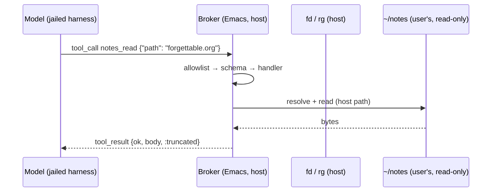
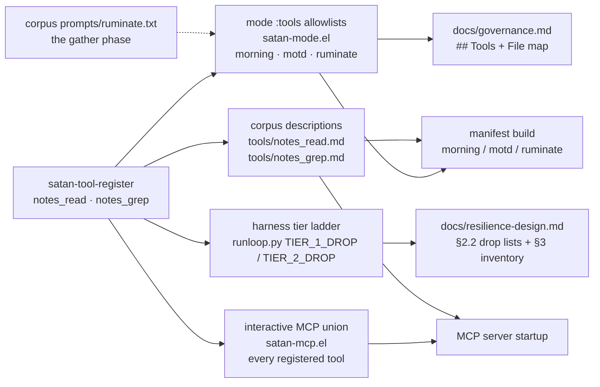

<!-- doctrine:section sec-1 -->
# What changes, and why

## Current behaviour

SATAN's tools see *that* the user's notes moved and *what* a narrow slice of them
says, but not what most of them say.

| Surface | What it can see |
|---|---|
| `notes_recent` | One window's worth of changed files: path, mtime, denote title/tags |
| `notes_at_satan_scan` | `@satan` directive regions only |
| `org_read_context` | Today's journal, this week's file, `inbox.org` — fixed |
| everything else under the notes root | nothing |

A `ruminate` run can observe that `forgettable.org` changed this week and cannot
read a line of it. That is the oldest unactioned item on the iteration board
(IT-001, first seen 2026-06-01) and it sits against the charter's first goal:
contact with the user's *stated* intentions.

The corpus is not absent from the container — `flake.nix` read-only binds
`$HOME/notes` at `/satan/notes` and exports `SATAN_NOTES_RO`. But nothing reads
it. SL-015 verified that neither the variable nor the path has a consumer
(`.doctrine/slice/015/design.md`, A1), and the reason is structural, not
oversight: the harness is a JSONL tool-call loop that opens only `bundle.json`
and `manifest.json`, and every SATAN mode spawns it as a tool-calling model with
**no shell**.

## The boundary this design sits on

That last fact is the design's foundation, so it is worth stating as a diagram.



The model never touches the filesystem. Its only door is the manifest, and the
manifest is assembled from the mode's `:tools` allowlist. So a corpus mount the
model cannot open is not a capability — **the tools are the boundary**, and this
slice widens what the broker will read on the model's behalf.

## Target behaviour

Two read-only tools on the existing notes module:

- **`notes_read :path`** — the body of one note, with the metadata `notes_recent`
  already computes, character-capped and flagged when truncated.
- **`notes_grep :query [:limit]`** — a case-insensitive literal search over the
  notes corpus, returning `{:path :line :text}` with paths relative to the notes
  root.

Together they close the loop the corpus has been missing: *find* a note, then
*read* it. Both are `risk = read`, carry no capability, and add no row to the
ADR-017 §3 authority ledger — they are content of the mode/tool allowlist that
row already owns. POL-001 seats `satan-tools-notes.el` in the Emacs client ("the
notes corpus as substrate"), so the mechanism stays where it is.

## Why the shape is a pair

Neither tool is much use alone. `notes_grep` without `notes_read` produces
locations that cannot be followed up; `notes_read` without `notes_grep` requires
the model to guess a filename, since `notes_recent` shows only what changed
recently. The user fixed the coupling explicitly: **every hit `notes_grep`
returns must be a file `notes_read` can open** (DEC-033), which is why the two
share one file set rather than each deciding its own.

<!-- doctrine:section sec-2 -->
# The read surface — `notes_read`

## Contract

| | |
|---|---|
| name | `notes_read` |
| risk | `read` (no capability) |
| args | `path` — string, required, notes-root-relative |
| handler | `satan-tool/notes-read` (the name freed by the rename in §4) |

Returns `(ok PLIST)`:

```elisp
(:scope       "notes_read"
 :root        "~/notes"                      ; the configured root, unexpanded form
 :path        "20260925T170411--protocol__design.org"
 :mtime       "2026-09-25T17:04:11+1000"     ; ISO-8601 local, as notes_recent emits
 :title       "protocol"                     ; denote slug → spaces; nil unless the
 :tags        ("design")                     ;   name is date-prefixed (see below)
 :ext         "org"
 :body        "#+title: ...\n..."
 :bytes       1841                           ; bytes returned
 :total-bytes 1841                           ; the file's size
 :truncated   nil)
```

`:title` and `:tags` come from the denote filename convention and are `nil`
unless the name carries the date prefix — `20260925T170411--protocol__design.org`
yields `"protocol"` and `("design")`, while a plain `protocol.org` yields `nil`
for both. That is the existing `--parse-basename` behaviour, unchanged.

Every refusal is `(error MESSAGE)`, never an empty success (DEC-029).
**This table is authoritative**; §4's resolver is its decomposition into code, and
the two are the same set — the resolver returns some rows, the handler adds the
rest, and nothing is produced that is not listed here.

| Refused | Message |
|---|---|
| the notes root is absent or not a directory | `notes root not found: ~/notes` |
| not a string | `path must be a string` |
| empty string | `path must be non-empty` |
| absolute path | `path escapes notes root: …` |
| any `..` component | `path escapes notes root: …` |
| resolves outside the root (a symlink escaping it) | `path escapes notes root: …` |
| a hidden component (`.git`, `.env`, `.dir/note.org`) | `hidden path not readable: …` |
| extension outside `.org`/`.md`/`.txt` | `not a note file: …` |
| no such file | `not found: …` |
| a directory, or the root itself | `not a file: …` |

The first six are one refusal wearing six faces — *this path is not a note in
this corpus*, so the remedy is the same: pick another file. The last four are
separated because their remedies differ (pick another file for the hidden and
extension cases; the file is absent; the target is not a file you can read).

The root check comes first because no path-shape reasoning is meaningful until
the root exists. Without it an absent root makes *every* path report as an
escape, and a model would vary the path forever rather than learn the corpus is
unreachable.

## The door, precisely

Three filters compose, and they are deliberately different kinds of rule:

1. **Containment** (DEC-029) — the resolved path's truename must lie inside the
   expanded notes root. This is the security boundary, and it is the only check
   that resolves symlinks: a symlink inside the corpus pointing outside it is
   refused here and nowhere else.
2. **No hidden components** (DEC-032) — any component beginning with `.` is
   refused. This covers configuration and tool state (`.git`, `.env`) and, as a
   side effect, `.` and `./foo` (whose first split component is `.`).
3. **Extension** (DEC-032) — `.org`, `.md`, `.txt`, case-insensitively, read off
   the *requested* name.

The root itself is refused by none of these three, and this is worth saying
plainly because an earlier draft claimed containment covered it: a directory is
"inside" itself, so `file-in-directory-p` returns true for the root. The root is
caught by the read step — it is not a regular file — and reports `not a file`.

Filters 2 and 3 are the *width* rule, not the boundary: they refuse nothing the
tools exist for (the blind spot is project pages, slips and journal-era notes,
all in those three formats) and they make the door's width auditable from the
tool description alone. The user's framing: "any file with a txt org or md
extension; nothing hidden (starting with a dot)".

## Truncation, and the deferred question

The body is capped in **bytes** at `satan-tools-notes-read-max-bytes` (a
defcustom, default 32768). Over the cap the tool returns the first N bytes, with
`:bytes N`, `:total-bytes M` (the file's size, from one `file-attributes` call)
and `:truncated t`. It does **not** error: a partially returned note is still
useful, and the flags make the partiality and its size explicit.

The unit is bytes, not characters, and that is a deliberate narrowing of the way
QUE-002 phrased it (`:chars` / `:total-chars`). Bounding at the read syscall
costs nothing and needs no decode; reporting a *character* total would require
decoding the whole file — the very cost the cap exists to avoid. The fields are
named for their unit so the two cannot be confused, and UTF-8 text has
`bytes ≥ chars`, so the cap never returns more than a reader expects.

This is a guard, not a solution, on the user's own reasoning (2026-09-25): a
limit is needed now, pagination can wait until a real note is found that the flat
cap renders useless. That deferral is **QUE-002** — with `:total-bytes` in the
result, the caller can at least see how much it is not seeing.

## Overlap with `org_read_context`

The journal, this week's file and `inbox.org` are readable through both tools.
The user chose to allow the redundancy rather than engineer it away, on the
condition that it is *obvious* (DEC-032 part 3). That condition is discharged in
the descriptions, not in code: `tools/notes_read.md` names the scopes
`org_read_context` serves over the same files, and `tools/org_read_context.md`
points back. Nothing tests those sentences (R5) — the alternative is a test
asserting prose, which pins wording nobody can then improve.

<!-- doctrine:section sec-3 -->
# The search surface — `notes_grep`

## Contract

| | |
|---|---|
| name | `notes_grep` |
| risk | `read` (no capability) |
| args | `query` — string, required; `limit` — integer, optional |
| handler | `satan-tool/notes-grep` |

Returns `(ok PLIST)`:

```elisp
(:scope     "notes_grep"
 :root      "~/notes"
 :query     "artifactless"
 :limit     30
 :count     2
 :truncated nil
 :matches   ((:path "journal/2026-05-20__idea.org" :line 12 :text "the artifactless case")
             (:path "protocol.org"                  :line 3  :text "artifactless-focus")))
```

`limit` clamps to `[1, 200]` and defaults to 30, reusing the module's existing
clamp constants and helper. Matches are capped at 50 in total, with
`:truncated t` when the cap bites.

**There is no per-file cap.** An earlier draft carried `--max-count 10`, which
would have made a note with fifteen hits contribute ten with `:truncated nil` —
a short answer that did not say it was short, and precisely the wrong-but-readable
shape DEC-030 forbids. The total cap is flagged; a per-file cap that could not
be flagged honestly has been dropped. One file may therefore contribute all 50
matches, and the flag will say so.

## The invocation

```elisp
(rg "--no-heading" "--line-number"
    "--ignore-case" "--fixed-strings"
    "--max-columns" "200" "--max-columns-preview"
    ;; built from `satan-tools-notes--openable-extensions', never restated
    "--glob" "*.org" "--glob" "*.md" "--glob" "*.txt"
    "--" QUERY (expand-file-name satan-tools-notes-root))
```

Each choice is either load-bearing or a stated cost bound.

**Literal, not regex.** The query targets the user's prose, and a model-typed
phrase like `C++` or `foo(` must not be silently reinterpreted as a pattern. The
tool that already searches this corpus made the same call — `notes_at_satan_scan`
uses `--fixed-strings` (`satan-tools-atsatan.el:148`) — whereas
`hippocampus_grep`'s regex (`satan-tools-hippocampus.el:250-305`) targets SATAN's
own curated titles, where patterns are worth having.

**Globs, not the default file set.** rg's default is every non-hidden,
non-ignored file; left at the default, `notes_grep` would return hits in files
`notes_read` refuses — a hit the model cannot follow. DEC-033 fixes the search
set to the openable set, so every hit is actionable by construction. The globs
are **derived** from `satan-tools-notes--openable-extensions` rather than
restated, so the two tools cannot drift apart by editing one list.

**Case-insensitive.** A search for what a note says should not care about
capitalisation.

**`--max-columns 200 --max-columns-preview`** bounds a single match line, and
the preview flag is what makes the bound honest. Without the preview, rg replaces
an over-long match with the literal placeholder `[Omitted long matching line]` —
verified against rg 15.2.0 with these exact flags — and the matching phrase is
unavailable. With it, the returned `:text` is the line truncated to the limit,
ending with rg's own marker `[... omitted end of long line]`, so a reader sees
both the phrase and the fact that the line continues. The bound is kept because
one unwrapped paragraph in a file that happens to carry one of the three
extensions would otherwise return a match of unbounded size against a budgeted
context.

Paths are printed absolute because rg is handed an absolute root; the handler
strips the expanded-root prefix so callers always see paths relative to the root,
matching `notes_recent`'s convention and making a hit directly usable as a
`notes_read` argument.

## What the guarantee is, and is not

DEC-033's purpose is that **every hit is openable**. That is a one-way
guarantee, and the recall loss is not symmetric:

- A match in a file outside the three extensions never surfaces. Accepted, and
  stated in the description.
- rg's ignore rules still apply with explicit globs, so a note that `~/notes`
  gitignores is openable by `notes_read` but invisible to `notes_grep`. This is
  the same filter `notes_recent` already applies through `fd`, so the corpus's
  notion of "the user's material" stays consistent across the two tools —
  deliberately kept rather than widened with `--no-ignore`, and disclosed rather
  than left implicit.

## Exit codes and the failure policy

| Condition | Result |
|---|---|
| the notes root is absent or not a directory | `(error "notes root not found: ~/notes")` |
| rg exits 0, matches printed | `(ok … :count N)` |
| rg exits 1 — *no matches* | `(ok … :count 0 :matches ())` |
| rg exits ≥ 2 | `(error "rg failed: exit N …")` |
| the `rg` binary is not on the host PATH | `(error "rg not found on PATH")` |

Exit 1 is a successful empty answer, not an error: it carries no ambiguity. Every
other failure is loud (**DEC-030**). This deliberately diverges from
`content_read`, whose search scope soft-fails to an empty result when rg is
absent (`satan-tools-content.el:242-260`) — a soft-failed search is
indistinguishable from a corpus with no hits, so the model would draw a
conclusion the tool cannot support. It follows SL-015's rule instead: a
wrong-but-readable answer is worse than an error.

The last row needs its own mechanism, because `call-process` does not produce it:
a missing binary signals `file-missing`, which the broker's dispatch
`condition-case` (`satan-tools.el:191-199`) would turn into a generic message.
§4 therefore resolves the binary explicitly before spawning it, exactly as
`satan-tools-content--resolve-rg` does for the same reason.

`fd` is resolved the same way. The module's policy is one — *an unavailable or
failing probe is an error* — but the two probes are not the same rule: `fd`
exits 0 on no matches, so rg's exit-1-as-empty clause applies to rg alone.
`notes_recent`'s existing check (`≠ 0 → error`) is correct as it stands and is not
changed by this slice.

<!-- doctrine:section sec-4 -->
# Inside the module

Everything lands in `satan/satan-tools-notes.el` — 178 lines today, +~130 after.
No new module: POL-001 already seats this one, and two handlers beside
`notes_recent` are the same responsibility (the notes corpus as a read surface).

## One subprocess helper, two callers

`--run-fd` is already program-agnostic apart from its name and its hardcoded
binary: it takes an argv list, captures stdout to a buffer, stderr to a temp
file, and returns `(:exit N :stdout STR :stderr STR)`. `notes_grep` needs
exactly that, so it becomes `satan-tools-notes--run (program argv)` — the same
body, parameterised — and both probes use it.

Program resolution is split out, because it is the part that must fail *loudly
and in the module's own words* rather than as a generic spawn error:

```elisp
(defvar satan-tools-notes--fd-program "fd")
(defvar satan-tools-notes--rg-program "rg")

(defun satan-tools-notes--resolve-program (name)
  "Return NAME's absolute path, or signal with the module's own message."
  (or (executable-find name)
      (error "%s not found on PATH" name)))
```

The two binaries stay separate variables so a test or a host can point one at an
absolute path without touching the other. No shared rg module is extracted across
`hippocampus`/`content`/`atsatan` in this slice: that would pull three unrelated
modules into the touch-set for zero behaviour change, and their policies
genuinely differ (§3). What remains duplicated is one argv builder per caller,
which is the part that is actually different.

The `fd` and `rg` callers use one argument builder for the *root*, too, so an
unreachable corpus is named once:

```elisp
(defun satan-tools-notes--root ()
  "Return the expanded notes root, or signal if it is not a directory."
  (let ((root (file-name-as-directory (expand-file-name satan-tools-notes-root))))
    (if (file-directory-p root)
        root
      (error "notes root not found: %s" satan-tools-notes-root))))
```

## The path resolver

Two invariants govern it; the code shows the mechanism, the prose carries the
rule, and an implementer must not re-derive either:

1. **Containment is decided on the resolved path; shape on the requested path.**
   The checks are independent and none subsumes another. Containment
   (`file-in-directory-p` against truenames) is the security boundary and the
   only check that follows a symlink, so it is what refuses a link inside the
   corpus that points outside it. The shape filters (hidden components,
   extension) read the *requested* name, so a symlink cannot smuggle a format
   the door is closed to — reading the extension off the resolved path would
   reopen exactly that.
2. **Containment does not cover the root itself.** A directory is inside itself,
   so `file-in-directory-p` is true for the root; the root is refused later, as
   not a regular file. The component checks are likewise their own refusals, kept
   for legibility rather than subsumed into containment — a `..` or `.` should
   read as "you asked for something outside the corpus" or "that is hidden", not
   emerge from a truename test that a corpus with legitimate internal symlinks
   would also fail.

```elisp
(defconst satan-tools-notes--openable-extensions '("org" "md" "txt"))

(defun satan-tools-notes--resolve (rel)
  "Return (:path ABS) for a notes-root-relative REL, or (:error MESSAGE)."
  (let ((root (satan-tools-notes--root)))
    (cond
     ((not (stringp rel))                            (list :error "path must be a string"))
     ((string-empty-p rel)                           (list :error "path must be non-empty"))
     ((file-name-absolute-p rel)                     (list :error (format "path escapes notes root: %s" rel)))
     ((member ".." (split-string rel "/"))           (list :error (format "path escapes notes root: %s" rel)))
     ((cl-some (lambda (c) (string-prefix-p "." c))
               (split-string rel "/"))               (list :error (format "hidden path not readable: %s" rel)))
     (t (let ((abs (expand-file-name rel root)))
          (cond
           ((not (file-in-directory-p abs root))     (list :error (format "path escapes notes root: %s" rel)))
           ((not (member (downcase (or (file-name-extension rel) ""))
                         satan-tools-notes--openable-extensions))
                                                     (list :error (format "not a note file: %s" rel)))
           (t (list :path abs))))))))
```

`file-in-directory-p` compares *truenames*, which is why it — and not a
`:pattern` on the arg schema — is what decides containment: a regex over a path
string cannot decide containment.

## The handler

```elisp
(defun satan-tool/notes-read (args _ctx)
  "Implements notes_read.  ARGS: (:path STRING)."
  (let* ((rel (plist-get args :path))
         (resolved (satan-tools-notes--resolve rel)))
    (if-let ((msg (plist-get resolved :error)))
        (cons 'error msg)
      (let ((abs (plist-get resolved :path)))
        (cond
         ((not (file-exists-p abs))  (cons 'error (format "not found: %s" rel)))
         ((not (file-regular-p abs)) (cons 'error (format "not a file: %s" rel)))
         (t (cons 'ok (append (satan-tools-notes--file-plist rel)   ; :mtime :title :tags :ext
                              (satan-tools-notes--read-capped
                               abs satan-tools-notes-read-max-bytes)))))))))
```

`:title`, `:tags` and `:ext` come from `--parse-basename`, already written for
`notes_recent`; `:mtime` from `--file-plist`. Reusing them is why the read tool
costs a few lines rather than a parser. The cap defcustom is passed at the call
site — the helper does not read globals, so a test can bind it.

`--read-capped` returns a plist the handler can append:

```elisp
(defun satan-tools-notes--read-capped (abs max)
  "Return (:body STR :bytes N :total-bytes M :truncated BOOL) for ABS.
The body is the first MAX bytes of the file, decoded as utf-8.")
```

It reads `max+1` bytes, decodes `utf-8` like every other read in the module, and
derives the flag from the observed length rather than assuming; `:total-bytes`
comes from one `file-attributes` call. Bounding in bytes is deliberate (§2): a
character cap would require decoding the whole file to know the count, which is
the cost the cap exists to avoid.

## The rename

`satan-tool/notes-read` is today the handler for **`notes_recent`**
(`satan-tools-notes.el:129`, registered at `:175`) — the name this slice's new
tool needs. It is renamed to `satan-tool/notes-recent`: the registration, the
**eleven** call sites in `satan/test/satan-tools-notes-test.el` (lines 58, 89,
107, 108, 109, 126, 129, 132, 145, 166, 174), and nothing else. No behaviour
change; the registered *name* (`notes_recent`) is untouched, so no mode, prompt
or description moves.

Leaving it would put two meanings on one symbol, which is the kind of thing a
later reader cannot detect from the registry.

## Registration

```elisp
(satan-tool-register (list :name "notes_read" :risk 'read
                           :args-schema (list 'path (list :type 'string :required t))
                           :handler 'satan-tool/notes-read))
(satan-tool-register (list :name "notes_grep" :risk 'read
                           :args-schema '(query (:type string :required t)
                                          limit (:type integer :required nil))
                           :handler 'satan-tool/notes-grep))
```

`(error MESSAGE)` results surface to the model as failed tool calls; the strings
above are the model-facing correction signal, which is why the path ones name the
path.

<!-- doctrine:section sec-5 -->
# The coupling web: three registries and the mind

Registering a tool is never a local act. This is the part of the design a reader
would otherwise have to reconstruct by grepping, so it is drawn out explicitly —
including the three enumerations an earlier draft of this section missed.



Two edges are hard failures rather than drift:

- **`D → M`**: `satan-tool--description` signals when a description file is
  missing, so a registration without its corpus text breaks the manifest build
  for the mode that allows it (`satan/satan-tools.el:216-224`).
- **`D → S`**: `satan-mcp--check-tool-descriptions` fail-fasts at MCP startup if
  any registered tool lacks one (`satan/satan-mcp.el:114-130`). Because `U` is
  the *union* of every registered tool, this fires for `notes_read`/`notes_grep`
  whether or not they are ever allowlisted — the keeper's interactive session
  will see them too, which the user accepted deliberately (**DEC-031**).

So the register-and-describe pair is one atomic step, in both directions.

## Mode allowlists

`morning`, `motd`, `ruminate` gain both names. These three are where reading a
note is the point: `morning` and `motd` orient on what the user is doing,
`ruminate` synthesises it into memory. `tick-*` is deliberately excluded — a tick
is a short reactive run, and widening its manifest buys nothing.

`satan-mode-check-tool-references` runs at load and refuses an allowlist entry
that does not resolve, so the allowlist cannot silently outrun the registry.

## The tier ladder (CON-001)

The harness withdraws tools as token budget is consumed: tier 1 drops survey
tools at 70%, tier 2 drops focused reads at 85%, tier 3 keeps only `satan_final`
(`satan/harness/runloop.py:35-56`). The sets are cumulative **drop** lists, which
means a tool in neither is available at every tier — a silent weakening of the
wind-down guarantee, and a bad default for the one tool whose whole purpose is to
pull note bodies into a budgeted context.

- `notes_grep` → `TIER_1_DROP` (a survey tool, beside `hippocampus_grep`,
  `docs_search`, `activity_read`).
- `notes_read` → `TIER_2_DROP` (a focused read, beside `org_read_context`,
  `hippocampus_read`).

CON-001 generalises it: **every registered tool is classified**. That is a rule
about future changes, so it is recorded as a constraint rather than left as a
thing this slice happened to do.

## Doc mirrors — four, not two

Four prose surfaces restate the registries above, and each needs its row. Missing
them is not cosmetic: three of the four are enumerations that a later reader
treats as the system's tool inventory.

| Surface | What it restates |
|---|---|
| `docs/governance.md` `## Tools` | the registry, name by name — asserted by the board's IT-011 two-way diff |
| `docs/governance.md` `## File map` | per-module tool ownership: the `satan-tools-notes.el` row currently names `notes_recent` only |
| `docs/resilience-design.md` §2.2 | the tier drop lists, in prose |
| `docs/resilience-design.md` §3 | the per-tool tier **inventory** — one row per tool, where both new tools are absent today |

## The mind half

Five corpus files, in `~/satan-corpus/`:

| file | change |
|---|---|
| `tools/notes_read.md` | new — contract, refusals, the `:bytes`/`:total-bytes` flags, the equivalence note pointing at `org_read_context` |
| `tools/notes_grep.md` | new — contract, the openable-set rule, the `[... omitted end of long line]` marker, both accepted recall losses |
| `tools/org_read_context.md` | the pointer back to `notes_read` (DEC-032 part 3) |
| `tools/notes_recent.md` | two sentences this slice falsifies: "read the file via a different tool" (now `notes_read`), and "the `satan/` subtree is always excluded" (false since SL-015 — the test asserts there is no `--exclude`) |
| `prompts/ruminate.txt` | the gather phase currently names `notes_recent` alone while `ruminate` is one of the three modes gaining the new tools; §1's motivating example *is* a `ruminate` run, so the mode's own instruction gains the "find, then read" pair |

The prompt edit is in scope for the same reason the descriptions are: adding a
tool to a mode's allowlist without the mode knowing what to do with it leaves the
capability unusable in practice, which is the gap this slice exists to close.

The jail is untouched. `flake.nix:145` read-only binds `$HOME/notes` at
`/satan/notes` and exports `SATAN_NOTES_RO`, and both remain unread. That is not
an inconsistency to fix in this slice: the tools run host-side in the broker, so
the mount is irrelevant to them, and removing a bind that costs nothing is a
separate cleanup with its own blast radius.

<!-- doctrine:section sec-6 -->
# Verification and code impact

## How this is judged done

**VT — mechanism** (`satan/test/satan-tools-notes-test.el`, extended). The
existing file already stubs `call-process` and records `(PROGRAM ARGS)`, so both
new surfaces are testable without a real `rg`. Test cases, named for behaviour:

| test | what it pins |
|---|---|
| `registry-exposes-read-and-grep` | both names resolve; `notes_recent` still registered, now via `satan-tool/notes-recent` |
| `read-returns-body-and-metadata` | body, `:bytes`, `:mtime`, and denote `:title`/`:tags`/`:ext` round-trip |
| `read-titles-only-date-prefixed-names` | a plain `protocol.org` yields `:title nil` — the parser's actual behaviour |
| `read-accepts-nested-and-plain-relative-paths` | `journal/protocol.org` and `protocol.org` both work |
| `read-refuses-paths-escaping-the-root` | absolute, `..`, empty, non-string (DEC-029) |
| `read-refuses-a-symlink-escaping-the-root` | a fixture symlink **inside** the root pointing outside it → `path escapes notes root`; this is the only case that exercises truename containment (F-9) |
| `read-refuses-the-root-and-a-directory` | the root itself and any directory → `not a file`; `.` → `hidden path not readable` (F-6) |
| `read-refuses-non-note-and-hidden-paths` | `.sh`, `.json`, extensionless, `.git/config`, `.dir/note.org` (DEC-032) |
| `read-errors-on-missing-file` | `not found`, distinct from the directory case |
| `read-truncates-at-cap` | binding `satan-tools-notes-read-max-bytes` small: `:truncated t`, `:bytes` at the cap, `:total-bytes` the real size (F-5, F-16) |
| `read-errors-when-notes-root-is-absent` | a root that does not exist is named as such, not reported as a path escape (F-6) |
| `grep-parses-matches-into-relative-paths` | argv carries the expanded root, `--ignore-case`, `--fixed-strings`, **the globs derived from the extension defconst** and `--max-columns-preview`; paths relativised; `:line` numeric (F-7, F-13) |
| `grep-does-not-cap-matches-per-file` | a stub returning 15 hits for one file returns 15 (F-8) |
| `grep-no-matches-is-ok` | rg exit 1 → `ok`, `:count 0` |
| `grep-errors-on-rg-failure` | exit 2 → `error` |
| `grep-errors-when-rg-is-absent` | `satan-tools-notes--rg-program` set to a missing binary → `(error "… not found on PATH")`, never empty (DEC-030, F-17) |
| `grep-caps-total-matches` | 60 hits → `:count` capped at 50, `:truncated t` |

**VT — tier ladder** (`satan/harness/test_gptel_harness.py`): `notes_grep`
dropped at tier 1, `notes_read` dropped at tier 2, following the file's existing
`test_filter_tools_tierN_*` shape.

**VT — registry↔allowlist**: `satan-mode-check-tool-references` passes (load-time
gate), and the `morning` manifest builds with both names — which requires the
broker test's description fixtures
(`satan/test/satan-broker-test.el:410-437, 457-485`) to carry them.

**VA — drift**: after the change, IT-011's
`registered-tools − ## Tools-table-rows` diff does not name either tool (it is
non-empty *before*, for 15 other names; the check is that the new ones are absent
from it). The four doc mirrors of §5 match the registries.

**VA — board**: IT-001's falsifier returns the new names —
`grep -rl 'notes_read\|notes_grep' satan/*.el`.

**Closure**: both tools callable in a `ruminate` or `morning` manifest, with
their descriptions loaded from the corpus, and the prompt in §5 naming them; the
board item closes on that evidence.

## What the tests cannot cover

Three things are settled by prose and review rather than by a test, each for a
stated reason:

- The DEC-032 equivalence sentences (`notes_read.md` ↔ `org_read_context.md`) —
  R5. Testing them means asserting prose, which pins wording nobody can improve.
- The `--max-columns-preview` marker semantics — the suite stubs `call-process`,
  so rg's own truncation behaviour never runs. Covered by the contract (§3) and
  the tool description.
- The `ruminate` prompt's usefulness — a human judgement at close.

## Code impact

| path | change |
|---|---|
| `satan/satan-tools-notes.el` | +2 defvars/defcustoms/defconsts; `--run-fd` → `--run`; `--resolve-program`; `--root`; `--resolve`; `--read-capped`; `satan-tool/notes-read` + `satan-tool/notes-grep`; 2 registrations; 1 handler rename |
| `satan/test/satan-tools-notes-test.el` | the 16 cases above; `--with-fd-stub` → `--with-exec-stub` and its recorder `--fd-calls` → `--exec-calls`; 11 rename call sites |
| `satan/test/satan-broker-test.el` | two description fixtures for the `morning` manifest gate |
| `satan/satan-mode.el` | `morning`, `motd`, `ruminate` `:tools` |
| `satan/harness/runloop.py` | `TIER_1_DROP` ∪ `notes_grep`; `TIER_2_DROP` ∪ `notes_read` |
| `satan/harness/test_gptel_harness.py` | two tier assertions |
| `docs/governance.md` | `## Tools` rows for both, and the `satan-tools-notes.el` `## File map` row |
| `docs/resilience-design.md` | §2.2 drop lists and the §3 per-tool inventory table |
| `~/satan-corpus/tools/notes_read.md`, `notes_grep.md` | new descriptions |
| `~/satan-corpus/tools/org_read_context.md`, `notes_recent.md` | edited as in §5 |
| `~/satan-corpus/prompts/ruminate.txt` | the gather phase names the pair |

Design-target selectors (recorded in the runbook step that follows this draft)
are the five mechanism paths; the corpus files live in the mind repo and are not
selectors here.

## Implementation order

The register-and-describe pair is atomic (§5), so the order is: descriptions in
the corpus → handlers + registrations → allowlists → tier ladder → doc mirrors →
prompt → tests green. Nothing is observable until the allowlists land, and
nothing *starts* until the descriptions are in place.

