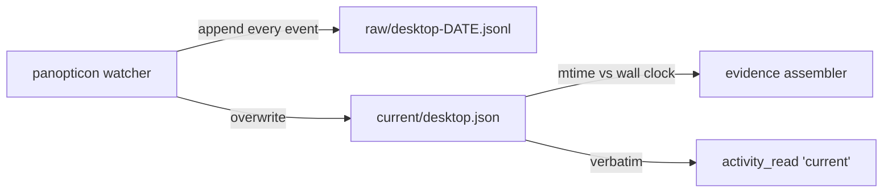
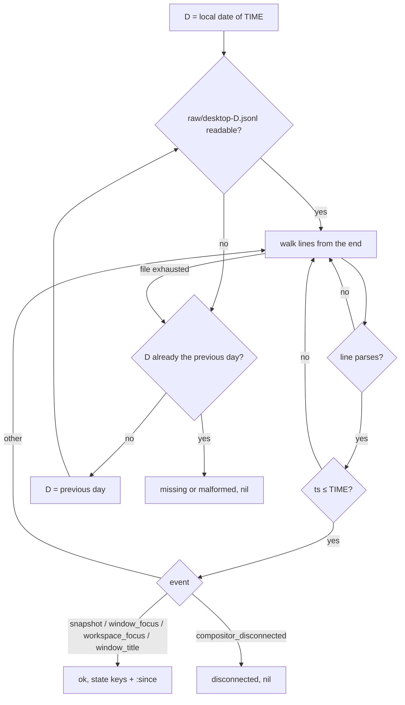

<!-- doctrine:section sec-1 -->
# What changes, and why

SATAN's evidence window — the bundle of recent behaviour a percept is built
from — carries one field, `:current_window`, that still describes *now*
rather than the window being perceived. It is read from panopticon's live
snapshot file `current/desktop.json`, and its freshness is the file's mtime
measured against the wall clock. Two defects follow:

- **A past window gets present-day state.** The observer assembles evidence
  for "30 minutes after an intervention"; today it receives whatever window
  is focused when it runs, reported `ok` because the age clamps to zero.
- **Idle reads as dead.** Five minutes without a desktop event — reading, a
  meeting — drops the field and raises `panopticon_current_stale` ("daemon may
  be dead"). The mtime cannot tell an idle user from a dead watcher.

ADR-001 (Amendment §2) names `current_window` as the last present-tense read
and delegates making it replayable to IMP-013; this slice is that move.

## Current behaviour



The watcher appends every desktop event to the raw log and overwrites the
snapshot after each one. It never touches the snapshot on disconnect, so the
file keeps showing the last window after the compositor is gone.

## Target behaviour


One pure reader, `satan-desktop-at`, answers "what was focused at instant T"
from the raw log. The evidence assembler asks it at the window end; the
`activity_read` tool asks it at the wall-clock now. SATAN no longer reads
`current/` at all (DEC-040).

The reader returns the state carried by the last state-bearing event at or
before T, stamped with `:since` — when that state was last set. It is never
dropped for age (DEC-035): an idle user stays `ok`, and `:since` states the age
honestly for whoever reads it. Liveness comes from the log's lifecycle events:
a `compositor_disconnected` before any later state reads `disconnected`
(DEC-037).

## The boundary

Panopticon owns the behaviour root and the raw event schema
(`panopticon/docs/schema.md`, "Desktop events"; SPEC-002 REQ-013). SATAN reads
it and writes nothing there. SATAN requires each producer to emit the **full
focused state on every state event**, and places that duty on panopticon
(DEC-036). SATAN takes each event's fields verbatim and never rebuilds state
from partial events.

That duty is an **assumption, not yet a published contract**. niri and umbriel
meet it today only as a property of the implementation: both route every
transition through `diff_state`, which emits `compact(new.to_dict())`
(`panopticon/compositor/diff.py:26-36`); umbriel folds its window and
workspace streams upstream, with a coherence hold. panopticon's `schema.md`
still documents sway's partial shape (`window_title` carries
`old_title`/`title`; `workspace_focus` carries
`old_workspace`/`workspace`/`output`). It also says a snapshot follows every
`compositor_reconnected`, which the live log contradicts
(`raw/desktop-2026-09-25.jsonl:338-339`: reconnected, then disconnected 1 ms
later). Until `schema.md` states the full-state rule, a panopticon refactor
could break SATAN without either repo noticing. The pin test in sec-5 is
SATAN's only guard, and a cross-repo follow-up in SL-021 asks panopticon to
publish the rule. A producer that breaks the rule (sway today, unused) yields a
partial window, fixed upstream.

The data plane stays append-only files (ADR-018 D3, SPEC-001 REQ-007); the
reader keeps no state between calls (ADR-018 D5) and writes nothing during
perception (ADR-001 Amendment §1).


<!-- doctrine:section sec-2 -->
# The reader — `satan-desktop`

## Placement

A new module, `satan/satan-desktop.el` (feature `satan-desktop`), requiring
`subr-x` and `satan-memory-canon` (for the strict instant parser and the
shared date helpers below; canon is pure and depends only on the grammar). It
cannot live in either caller:
`satan-memory-evidence` already requires `satan-tools-activity`, so a reader in
the evidence module could not be reached from the tool without a require
cycle, and a reader in the tool module would make evidence depend on a tool
handler for its core input. The module knows panopticon's raw desktop schema
and nothing about SATAN's callers; the behaviour root is an argument, not a
defcustom it reads. (DEC-039, amended.)

## Shared date helpers (lifted into canon)

The reader needs two date operations that already exist, each in the wrong
home for reuse: `satan-goad-local-date` (`satan-goad.el:58-68`; the local date
of a parsed instant in a zone) and `satan-memory-evidence--next-day`
(`satan-memory-evidence.el:273-285`; calendar arithmetic). `satan-desktop`
cannot require `satan-goad`, because goad pulls in `satan-intervention`. So both
move to `satan-memory-canon.el`, next to `satan-memory-canon-parse-instant`,
which they build on:

```elisp
(satan-memory-canon-local-date TS &optional ZONE) → "YYYY-MM-DD" | nil
(satan-memory-canon-day-shift DAY N)              → "YYYY-MM-DD"
```

- `local-date` is today's `satan-goad-local-date` body: the strict parser plus
  `(format-time-string "%F" instant zone)`, where a nil ZONE means Emacs's
  local zone. `satan-goad-local-date` keeps its name and its
  `satan-goad--zone` seam, and delegates.
- `day-shift` is pure calendar arithmetic on the `YYYY-MM-DD` string
  (`calendar-absolute-from-gregorian` + N; canon gains `(require 'calendar)`). It involves no zone and no DST day
  length. `satan-memory-evidence--next-day` becomes `(day-shift DAY 1)`. The
  reader uses `(day-shift D -1)`.

Each consumer keeps its own zone seam variable (`satan-goad--zone`,
`satan-desktop--zone`; nil in production), so pinning one module's zone in a
test does not move the other's. The logic exists once.

## Contract

```elisp
(satan-desktop-at ROOT TIME) → (STATUS . WINDOW)
```

- `ROOT` — the behaviour root directory (callers pass `satan-tools-activity-dir`
  or the assembler's `:behaviour_dir`).
- `TIME` — an ISO-8601 string, any offset (`Z` or `+10:00`, with or without
  milliseconds).
- `STATUS` — one of the strings `"ok"`, `"disconnected"`, `"missing"`,
  `"malformed"` (JSON-ready; same type as the other `:sensor_status` entries).
- `WINDOW` — a plist when `STATUS` is `"ok"`, else nil.

`WINDOW` is the deciding event's state keys, verbatim, plus `:since`:

```elisp
(:window_id "a5341663eb115c20ee569908193729ee"
 :app_id "com.mitchellh.ghostty" :pid 14745
 :title "~/dev/goad" :workspace "emacs" :output "DP-3"
 :since "2026-09-26T01:44:29.059+10:00")
```

State keys are exactly panopticon's `DesktopState` fields: `window_id`,
`app_id`, `pid`, `title`, `workspace`, `output`. Absent keys stay absent
(panopticon omits nulls). Envelope and event-specific fields (`v`, `ts`,
`source`, `event`, `producer`, `old_title`, `old_workspace`, `reason`) are not
copied. `:since` is the deciding event's `ts` string verbatim: the full state,
title included, has been unchanged since then. It is *not* "focused since" —
focus duration is the focus segments' job.

**No focused window.** A state event that carries no window keys (`window_id`,
`app_id`, `pid`, `title`) means nothing is focused. This is routine, not a
corner case. `diff_state` emits `window_focus` whenever focus leaves to no
window (`diff.py:33-34`; `compact` drops the null keys). Live niri logs carry
149–220 such `window_focus`/`workspace_focus` events a day, each holding only
`workspace`/`output`. umbriel logs 7–13 a day with no state keys at all, and
logged one empty `snapshot` (`raw/desktop-2026-09-19..25.jsonl`). The rule is
the same for every state event type: it decides `ok`, and the window is
whatever keys it carries plus `:since`. That may be `workspace`/`output`/`:since`,
or `:since` alone. So a window without `:app_id` means "panopticon is up and
nothing is focused", not "unknown".

## The walk



- **Day files (DEC-038).** `D` is `(satan-memory-canon-local-date TIME
  satan-desktop--zone)`: the local calendar date of the parsed instant, never
  a substring of the string (ISS-021). The previous day is
  `(satan-memory-canon-day-shift D -1)`. At most two files are read.
- **Backward walk (DEC-039).** The file is inserted into a temp buffer, decoded
  as UTF-8 (`coding-system-for-read` bound to `utf-8`, like every other SATAN
  reader, e.g. `satan-jsonl.el:117`; panopticon writes UTF-8, `store.py:60`), and
  walked from `point-max` a line at a time. Titles are copied verbatim into
  `:current_window` and `activity_read`, and live titles are non-ASCII (`✳`,
  `π`). Cost is proportional to the events after `TIME`: about zero for a live
  tick, bounded by one file for the observer's past windows. Measured on the
  largest real day file (3.85 MB, 15,947 lines): live case, whole-file insert
  plus the last line, 11 ms; worst past case, every line parsed and compared,
  251 ms.
- **Leniency.** A line that does not parse as a JSON object, or whose `ts`
  the strict parser rejects, is skipped. Panopticon appends concurrently, so a
  torn last line is normal and must not change the status.
- **Instants, not strings.** `TIME` and each `ts` are parsed with
  `satan-memory-canon-parse-instant` (strict ISO 8601 with an offset; nil
  otherwise) and compared with `time-less-p`, never `string<`: raw lines carry
  `+10:00` with milliseconds, callers may pass `Z` or none. The parser
  resolves to whole seconds, so an event in the same second as `TIME` counts
  as at-or-before; tests must not assert sub-second ordering. An unparseable
  `TIME` is a caller bug and signals.
- **Deciding events.** Walking back, the first parseable event at or before
  `TIME` that is a state event (`snapshot`, `window_focus`, `workspace_focus`,
  `window_title`) or a `compositor_disconnected` decides.
  `compositor_reconnected` and producer-specific pass-through events
  (sway's `window_new`, `window_close`, …) are skipped because they carry no
  focused state (DEC-036, DEC-039). `compositor_reconnected` is also not proof
  of a connection: the runner writes it as soon as `client.session()` enters
  (`runner.py:113-116`), and umbriel's `_open` yields its session before it
  reads any frame (`umbriel/session.py:114-116`). So a disconnect followed only by a reconnect still reads
  `disconnected` until a state event arrives.
- **`missing` vs `malformed`.** When neither file decides: `malformed` if some
  file was non-empty and none of its lines parsed; otherwise `missing` (no
  file, or files with no deciding event at or before `TIME`).

## Invariants

- Pure with respect to SATAN state: reads two files at most, writes nothing,
  keeps nothing between calls.
- The same `(ROOT, TIME)` over the same files gives the same answer —
  appending events after `TIME` never changes it (replayability).
- `STATUS` is `"ok"` iff `WINDOW` is non-nil.

The first two invariants rest on two premises, both properties of the
deployment, not of SATAN:

- **Append order is timestamp order.** panopticon stamps `ts` from the wall
  clock when it encodes the event and appends at once (`store.py:54-60`). The
  walk and the replayability invariant both assume that later lines carry
  later-or-equal `ts`. If the wall clock steps backward by Δ (an NTP
  correction), lines written after the step can carry a `ts` earlier than lines
  before it. The walk then decides on the most recently *appended* line with
  `ts ≤ TIME`. For a live read that is the right answer. For a past `TIME`
  inside the Δ overlap, the answer can change once the overlapping lines are
  appended. The damage is bounded by Δ, usually sub-second. DEC-039 accepts
  this order dependence: it rejected binary search as fragile to disorder, and
  an order-free rule (the maximum `ts ≤ TIME` in the file) would scan the whole
  file on every live tick.
- **panopticon and Emacs share a local zone.** panopticon names each day file
  by the date in its own `ts` offset (`store.py:56`, `event.ts[:10]`). The
  reader picks `D` in Emacs's zone. Both run as the same user's session
  services on the same host, so the zones agree. If they differed, the reader
  would look in the wrong day file near midnight, and the previous-day
  fallback would hide the error only in one direction.

<!-- doctrine:section sec-3 -->
# The evidence assembler and sensor alerts

## `satan-memory-evidence.el`

The `:current_window` probe in `satan-memory-evidence-assemble-with-bounds`
becomes one call, evaluated at the window **end**, not at `:time_now`:

```elisp
(current-probe (satan-trace-stage "evidence.current_window"
                 (satan-desktop-at root end)))
```

For a tick the two are equal (`--bounds` sets END to TIME-NOW); for the
observer, END is the intervention's maturity point, which is exactly what it
means to ask. The probe still runs under `:cue_only` — it is the only observed
handle on the `memory_resonate` cue path — and the reader's live-case cost keeps
that cheap. `(car current-probe)` feeds `:sensor_status :current_window`,
`(cdr current-probe)` feeds `:current_window`, as today.

Removed, with no remaining caller:

| symbol | why it goes |
|---|---|
| `satan-memory-evidence-current-window-stale-seconds` | no age-based staleness (DEC-035) |
| `satan-memory-evidence--current-window-status` | replaced by `satan-desktop-at` |
| `satan-memory-evidence--mtime` | its only caller was the above |

`satan-memory-evidence--next-day` keeps its name and its callers, and its body
becomes `(satan-memory-canon-day-shift DAY 1)` (sec-2, "Shared date helpers").
`--age-seconds` and `--stale-tag` stay: the focus and browser segment probes
still use them. The file header's `:cue_only` note ("Keeps the 'what is now'
probe") becomes "keeps `current_window`, replayed at the window end", and
`(require 'satan-desktop)` joins the requires.

**Consumers do not move**, with one visible nuance. Canon's `panopticon.current.app` rule reads only
`:app_id` (`satan-memory-canon.el`); the tank reads `:app_id`, `:title`,
`:workspace` (`satan-tank.el`). The new `:since` key is ignored by both and
adds about 40 bytes to `percept.json` (ISS-001's budget is unaffected in
practice). The observer does not read `:current_window`; it now receives the
historically correct value instead of today's silently live one. The nuance:
a state event with no focused window yields a window of just workspace/output
and `:since`, which the tank renders as `current: ? · ws=emacs ·` rather than
`(no panopticon)` — accurate (panopticon is up, nothing is focused), and left
as is. This is the everyday "nothing focused" case, not a rare snapshot
(sec-2, "No focused window"). The tank shows `current: ? · ws=… ·` whenever
focus has left every window.

## `satan-sensor-alerts.el`

The `:current_window` rows of `satan-sensor-alerts--causes` (DEC-037):

| status | cause | message | remediation |
|---|---|---|---|
| `disconnected` | `panopticon_current_disconnected` (new) | panopticon's compositor connection is down; focused window unknown | `systemctl --user status panopticon-sway` |
| `missing` | `panopticon_current_missing` (kept) | no desktop state in the day's or previous day's raw desktop log | `systemctl --user status panopticon-sway` |
| `malformed` | `panopticon_current_malformed` (kept) | panopticon desktop log has no parseable line | inspect `raw/desktop-YYYY-MM-DD.jsonl` under `satan-tools-activity-dir` |
| `stale` | `panopticon_current_stale` — **removed** | | |

The `missing` message covers every way of reaching that status: no file, or
files whose lines are all after `T` or are only `compositor_reconnected`/pass-
through events. The malformed hint names the file by its pattern and the root
by its variable, not by a host path (SPEC-002 REQ-018), and not by a shell
command. The failing file may be the previous day's, or a past day's for the
observer, so a `$(date +%F)` command would point at the wrong one. `panopticon-sway` is still the unit's name
(`~/flakes/modules/home/linux/behaviour.nix`), despite running the neutral
`panopticon-desktop`.

`satan-sensor-alerts--match-kind` gains `"disconnected"` in its exact-match
set; the `stale-` prefix rule stays for the segment sensors. The capsule line
renders the new status `current=DISCONNECTED` through the existing uppercase
rule, with no change.

Everything downstream is unchanged: causes still pass through the
record-before-emit seam (DEC-016, DEC-018), `notify_send`, and per-cause
cooldown in `notified.json`. The retired `panopticon_current_stale` cooldown
entry is dropped on the next read: `--read-state` runs `--prune-state`, which
drops any `:causes` key outside `--known-causes`
(`satan-sensor-alerts.el:162-191`). That prune is generic and needs no change.

The retired cause name also appears as sample data. It is replaced by
`panopticon_current_disconnected` everywhere, so SATAN's examples and tests name
only live causes and the closure grep (sec-5) can require zero hits:

- `satan/protocol/fixtures.json` (`actions-with-pre-spawn-sensor-alert`); its
  message text changes from the stale wording to the disconnected one;
- `satan/test/satan-audit-test.el:53,75,113` and
  `satan/test/satan-broker-test.el:1196,1235`, where the cause is an opaque
  string passed through audit and broker plumbing.


<!-- doctrine:section sec-4 -->
# `activity_read`'s `current` scope

Today the scope returns `current/desktop.json` verbatim, which keeps
reporting the last window after the compositor disconnects. It becomes a call
to the same reader at the wall-clock now (DEC-040):

```elisp
("current"
 (let ((probe (satan-desktop-at root (format-time-string "%FT%T%:z"))))
   (cons 'ok (list :scope "current"
                   :status (car probe)
                   :window (cdr probe)))))
```

Output contract, before → after:

| key | before | after |
|---|---|---|
| `:scope` | `"current"` | unchanged |
| `:window` | snapshot plist, or nil if the file is absent | reader's window (state keys + `:since`), or nil unless `:status` is `"ok"` |
| `:status` | — | `"ok"` / `"disconnected"` / `"missing"` / `"malformed"` |
| `:path` | `current/desktop.json` | **dropped** |

`:path` goes because the reader may answer from yesterday's file; a path that
is sometimes the wrong one is worse than none (DEC-040).

The handler stays a successful `ok` result whatever the status: a disconnected
compositor is information for the model, not a tool failure — the same
posture as today's `:window nil` for a missing file.

## The model-facing description

The tool's description lives in the corpus
(`~/satan-corpus/tools/activity_read.md`, a separate repo). Its `"current"`
entry changes from "snapshot of the currently-focused window" to the replayed
window with `status` and `since`. It says what `disconnected` and `missing`
mean, and that an `ok` window without `app_id` means nothing is focused
(sec-2, "No focused window"). The file header comment in
`satan-tools-activity.el` ("snapshot from sway") is corrected likewise.

**Landing order.** The package and the corpus ship separately (SPEC-002
REQ-015): Emacs reads the description from `~/satan-corpus` as soon as the file
changes, but it runs the new handler only after the package is deployed. So the
description lands **after** the package change. In between, the model reads
the old description against the new output. That gap is only additive: two new
keys, `status` and `since`, and one dropped key, `path`, which the old
description does not promise. The reverse order would describe a `status` the
tool does not yet return.


<!-- doctrine:section sec-5 -->
# Verification and code impact

## Test fixture

A new fixture module, `satan/test/satan-desktop-fixture.el` (the
`satan-goad-fixture.el` precedent: required by suites, not a suite), gives
every suite one way to write raw desktop days:

```elisp
(satan-desktop-fixture-event TS EVENT &rest FIELDS)  ; → plist in raw shape
(satan-desktop-fixture-write ROOT DAY EVENTS)        ; → raw/desktop-DAY.jsonl, UTF-8
```

It replaces all five hand-rolled `current/desktop.json` writers:

- `satan-percept-test--write-sway` (`satan-percept-test.el:41-46`);
- `satan-percept-test--seed-fixture`'s inline writer
  (`satan-percept-test.el:318-328`, acceptance A3);
- `satan-resonance-test--write-sway` (`satan-resonance-test.el:325`);
- `satan-tools-activity-test--write-current-sway`
  (`satan-tools-activity-test.el:54`);
- the inline writers in `satan-memory-evidence-test.el` (`:187`, `:239`,
  `:499`, `:517`, `:553`, `:572`).

Fixtures stop depending on file mtimes and the age clamp: an event
timestamped before the frozen `time_now` is simply the state at that time.

## Key test cases

New suite `satan/test/satan-desktop-test.el`, against `satan-desktop-at`:

- returns the state of the last event at or before T, not a later one
- `:since` is the deciding event's `ts`; a later title change moves it
- an event hours before T still reads `ok` (idle is not stale)
- a trailing `compositor_disconnected` reads `disconnected` with nil window
- `compositor_reconnected` is skipped: after a disconnect it still reads
  `disconnected`; a following `snapshot` decides `ok`
- no focused window: a `window_focus` carrying only `workspace`/`output`
  reads `ok` with exactly those keys plus `:since`; a `window_focus` with no
  state keys, and an empty `snapshot`, read `ok` with only `:since`
- sway pass-through events (`window_new`, `window_close`) are skipped
- envelope and event-specific keys are not copied into the window
- a non-ASCII title (`✳`, `π`) round-trips byte-for-byte into `:title`
- nothing at or before T today falls back to yesterday's file
- nothing in today's or yesterday's file reads `missing`; no third day is read
- a torn last line is skipped without changing the status
- a non-empty file with no parseable line reads `malformed`
- T given as a `Z` instant is compared by instant against `+10:00` lines
- events appended after T do not change the answer
- the day file is chosen by the local date of T under `satan-desktop--zone`
  (a `Z` T late in the UTC day selects the next local day's file)
- pin test: real umbriel- and niri-shaped lines copied from a live raw file
  (`window_title` / `window_focus` / windowless `window_focus` / `snapshot` /
  lifecycle) decide as above; see "What the tests cannot cover"

`satan-memory-canon-test.el` — `satan-memory-canon-day-shift` crosses month
and year ends and 29 February, in both directions (pure calendar; no zone
involved); `satan-memory-canon-local-date` carries over the zone cases from
`satan-goad-test.el` VT-24.

Updated suites:

- `satan-memory-evidence-test.el` — a past `[start, end]` gets the window
  focused at `end`, not a later one; `:cue_only` keeps `:current_window`;
  `:sensor_status :current_window` reports `disconnected` / `missing` /
  `malformed`; the mtime-stale cases are deleted; the `--next-day` cases stay
  and still pass through the delegation.
- `satan-sensor-alerts-test.el` — `disconnected` derives
  `panopticon_current_disconnected`; the only causes a `current_window` status
  can derive are the three live ones (asserted as a set, so the test never
  names the retired cause). The prune test
  (`read-state-prunes-retired-cause-residue`, `:431-456`) currently uses
  `panopticon_current_stale` as its *live* control. The control becomes
  `panopticon_current_disconnected`, and the retired residue it seeds stays
  `bough_unreachable`. The test does not need to name the stale cause to show
  that a retired cause is pruned. `known-causes-covers-every-table-entry`
  (`:458-467`) asserts the new cause instead of the retired one.
- `satan-tools-activity-test.el` — `current` returns `:status` and the
  replayed `:window`, and `disconnected` after a disconnect.
- `satan-percept-test.el`, `satan-resonance-test.el` — fixtures move to the
  fixture module; assertions unchanged.
- `satan-audit-test.el`, `satan-broker-test.el` — sample cause string only
  (sec-3).
- `satan-goad-test.el` — unchanged; it keeps pinning `satan-goad-local-date`
  through its delegation.

## What the tests cannot cover

That panopticon's live producers keep emitting full focused state (DEC-036) is
a fact about another repo, and an unpublished one (sec-1, "The boundary"). The
fixture encodes it, and the pin test holds the reader against real lines, per
the "stub is a claim about a foreign binary" pattern. If the pin lines ever
disagree with fresh live output, panopticon's shape has moved.

That panopticon and Emacs share a local zone, and that the wall clock does not
step backward, are deployment premises (sec-2, "Invariants"). They are not
tested.

## Code impact

| path | change |
|---|---|
| `satan/satan-desktop.el` | **new** — `satan-desktop-at`, `satan-desktop--zone`, private helpers |
| `satan/satan-memory-canon.el` | **new** `satan-memory-canon-local-date`, `satan-memory-canon-day-shift` |
| `satan/satan-goad.el` | `satan-goad-local-date` delegates to canon |
| `satan/satan-memory-evidence.el` | probe → `satan-desktop-at` at END; remove stale defcustom, `--current-window-status`, `--mtime`; `--next-day` delegates to canon; header doc |
| `satan/satan-sensor-alerts.el` | `:current_window` cause rows; `--match-kind` accepts `disconnected` |
| `satan/satan-tools-activity.el` | `current` scope calls the reader; drop `:path`; header comment |
| `satan/protocol/fixtures.json` | sample cause name and message |
| `satan/test/satan-desktop-fixture.el` | **new** fixture module |
| `satan/test/satan-desktop-test.el` | **new** suite |
| `satan/test/satan-memory-canon-test.el` | date helper cases |
| `satan/test/satan-memory-evidence-test.el`, `satan-sensor-alerts-test.el`, `satan-tools-activity-test.el`, `satan-percept-test.el`, `satan-resonance-test.el`, `satan-audit-test.el`, `satan-broker-test.el` | fixtures, samples and cases above |
| `~/satan-corpus/tools/activity_read.md` | `current` scope description (corpus repo; lands after the package, sec-4) |

Closure evidence: `just check` green, and this grep returns nothing:

```sh
rg -n 'desktop\.json|current/desktop|panopticon_current_stale|current-window-stale|current-window-status' satan/
```

(`satan/` includes `test/` and `protocol/`. As a positive control, the same
grep before the change hits 11 files, among them `satan-memory-evidence.el:457`
and `satan-percept-test.el:45`.) Repo `docs/` prose is reconcile's job, not
this grep's.

